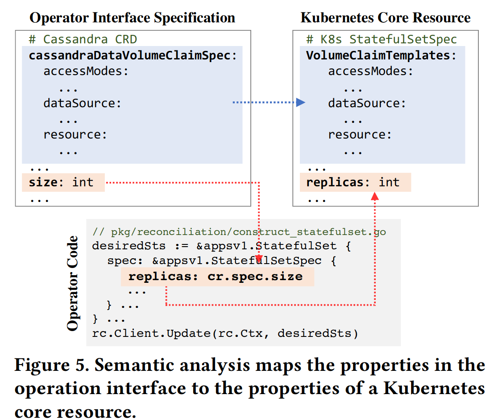
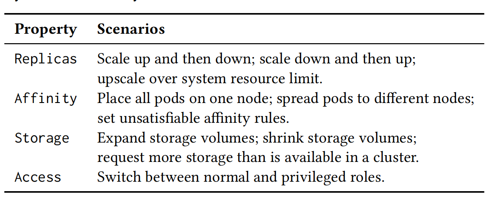

## 背景
许多部署在 Kubernetes 等现代云平台上的系统使用 operator 替代人工部署，但这些 operator 通常没有完整的 e2e 测试，极大的影响了分布式系统的可靠性。

由于这些原因，人工编写完善的 e2e 测试基本上是不可行的：
1. 开发者很难在庞大的状态空间中构造良好的测试用例。人工编写的 e2e 测试通常从理想的初始状态触发，一步（只修改一次 spec）到达最终状态。这种测试无法覆盖足够多的状态转移。
2. operator 的开发者和被管理的系统的开发者往往不是一拨人，operator 开发者很难有足够的知识完善 e2e 测试。
3. operator 的协调循环（reconcile loop）涉及大量状态迁移，其中一些还涉及被管理系统的细节。

论文开发了一个自动生成 operator e2e 测试的框架 Acto，发现了大量流行的系统的 operator 中的 bug，其中某些 bug 甚至是由 Kubernetes 和 Go 语言运行时的 bug 导致的。
## 设计
Acto 的诞生很大程度上源自 Kubernetes 的特殊性——以状态为中心：
1. Kubernetes 以状态为中心，用户只需要通过声明式 API 声明目标状态，Kubernetes 和 operator 就能通过协调循环（reconcile loop）从任意起始状态到达目标状态。
2. operator specification 的很多 property 可以还原到 Kubernetes 内置[对象](https://kubernetes.io/zh-cn/docs/concepts/overview/working-with-objects/)的 property。

这两大特征促使了 Acto 的诞生：
1. Acto 同样以状态为中心，通过检测 Kubernetes 状态判断 operator 是否正确，通过状态迁移（修改 operator spec）驱动 e2e 测试进行。
2. Acto 通过将 operator specification 的 property 还原到 Kubernetes 核心资源的 property，实现通用的(不依赖特定 operator) operator e2e 测试生成。

Acto 存在两个版本：
1. 黑盒版本：只需要 operator 的接口（operator spec），不需要 operator 的源代码。
2. 白盒版本：不仅需要 operator 的接口，还需要 operator 的源代码。

Acto 通过不断进行状态迁移，驱动 e2e 测试进行。状态即当前状态和 operator spec 设定的目标状态，状态驱动通过修改 operator spec 即可。这里存在三个关键问题：
1. 什么是正确的 operator 操作？
2. 如何确定系统的 property？
3. 如何确定 property 依赖关系？
4. 向何处进行状态迁移？
5. 如何判断当前状态正确？

Acto 以状态为中心，因此对于 operator 操作的正确性描述也以状态为中心：
1. 可以从任何正确的状态驱动被管理系统到目标状态。
2. 如果进入错误或非预期的状态，回滚到上一个正确的状态。
3. 能够应对错误的操作（misoperation，指用户给出错误的 operator spec，如 replica 为 -1 等）。

Acto 适用于所有 operator，将 operator spec 的 property 还原成 Kubernetes 核心资源的 property。Acto 直接修改 Kubernetes 核心资源的 property，驱动状态迁移。

从 operator spec 还原到 Kubernetes 核心资源的方法如下：
- Acto 黑盒：通过 operator spec 的 property  和 Kubernetes 核心资源property 的命名推测。
例如，Cassandra CRD 的`cassandraDataVolumeClaimSpec`和 Kubernetes StatefulSet 的`VolumeClaimTemplates`结构相同，Acto 将`cassandraDataVolumeClaimSpec`还原成`VolumeClaimTemplates`，状态迁移时修改`VolumeClaimTemplates`的 property。
- Acto 白盒：通过语义分析，将 operator spec 还原到 Kubernetes 核心资源。
注意，并非所有 Operator Spec 的所有 property 都能直接通过命名推测映射到 Kubernetes 核心资源，但大多数 property 都可以通过命名推测出来。

property 间的依赖关系，以类似的方法得到：
- Acto 黑盒：通过命名推测。
通常，某个 property 都只在子属性`Enabled`为 true 时才启用。论文的数据表明，这种推测可以覆盖 98.5% 的依赖关系。
- Acto 白盒：通过控制流分析寻找 property 依赖。
Acto 白盒解析源代码，寻找某 property 只在另一 property 满足某种条件时才启用的情况。

>[!NOTE]
>Acto 黑盒的猜测不一定正确，因此导致了假阳性，但论文数据显示误报率只有 0.2%。这说明大多数 operator 都遵守 Acto 发现的 pattern。

Acto 用以下三种测试策略探索状态空间：
- 单操作：只修改一次 operator spec 就到达最终状态。
- 一系列操作：修改多次 operator spec 才到达最终状态。
- 到达错误状态时回滚到上次正确状态，继续测试

状态转移时，Acto 用以下策略生成 property 的值：
- 每次修改一个 property。
- 优先修改没有修改过的 property，从而确保测试期间所有 property 都被修改过至少一次。
- property 的值以情景为中心，如先扩容再缩容等。
- 某些 property 无法被映射到 Kubernetes 核心资源，对于这些 Acto 无法理解的 property，生成符合语法和限制的值即可，不考虑语义是否正确。

>[!NOTE]
>Kubernetes operator specification 会生成一个 specification 的 schema，记录每个 property 的类型和限制。Acto 根据这个 schema 生成符合语法和限制的值。

Acto Oracle 检测当前状态是否匹配期待的状态，主要通过以下三种手段：
- Consistency Oracle：检测 operator 视图和 Kubernetes 视图是否一致，不一致说明 operator 出错。
这种情况的主要场景是，operator 认为已经到达目标状态，因此停止协调循环，但 Kubernetes 状态并未到达目标状态。例如RediScreenshot_20231119_175018sOp 认为`minAvailable`已经为 2（这时 Kubernetes `PodDisruptionBudget`的`redis-follower`一定不为空），但实际上`PodDisruptionBudget`的`redis-follower`为`null`。

- Differential Oracle：从不同起始状态出发，对于同一操作一定能够能到达相同的期待状态，否则 operator 有 bug。
这种情况主要是由于协调循环不完善，只能从特定起始状态到目标状态，也可能是回滚失败。

- Normal Check：检测状态码、日志错误信息和系统抛出的异常等。

Acto 会记录测试失败时的 snapshot，并生成最小化的测试代码，用于复现 bug。

此外，值得注意的是 Acto 还有插件机制，可以拓展 Acto 的功能。比如让用户指定 operator spec 的某个 property 的含义。

## 评估
Acto 发现了大量 bug，而且只需要 8 小时就能运行完一个 operator 的全部 e2e 测试。

Acto 黑盒可能由于 property 猜测失败导致假阳性，但误报率只有 0.2%。Acto 白盒没有出现假阳性。

## 限制

- 只能测试单个 operator，实际的系统可能由多个 operator 管理。
- 无法注入故障，因此只能测试理想环境下 operator 的正确性。
- 完全以状态为中心，无法测试被管理的系统自身是否正确。可能存在状态正确，但 operator 的 bug 导致被管理的系统行为异常，例如违反了规定的一致性。

