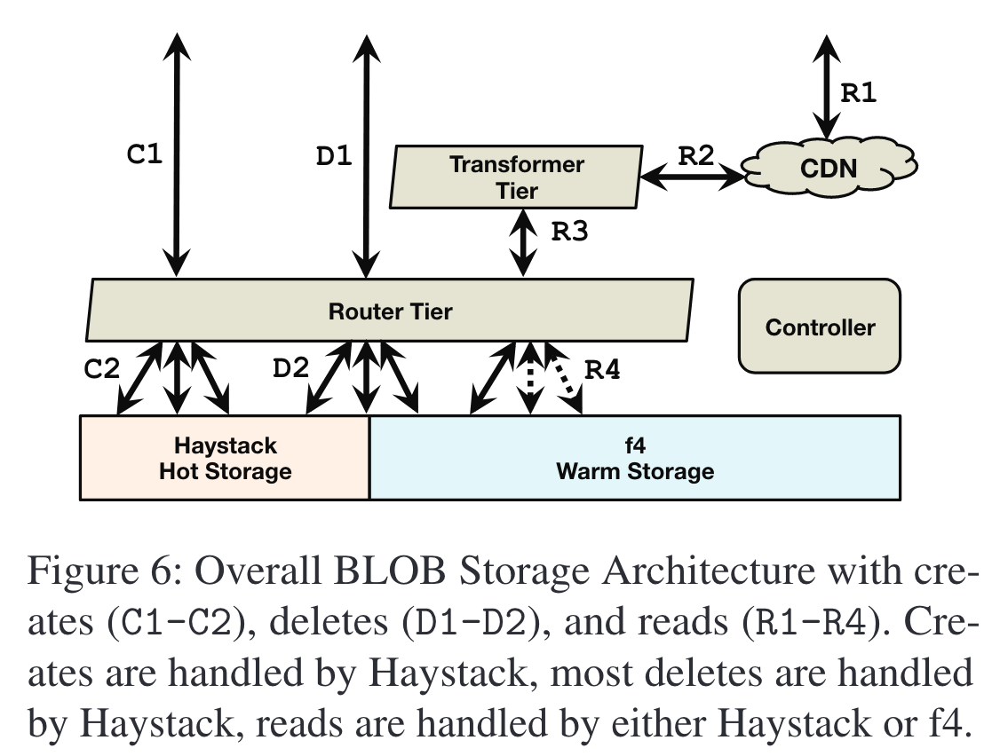
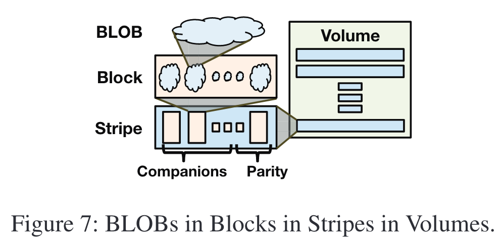
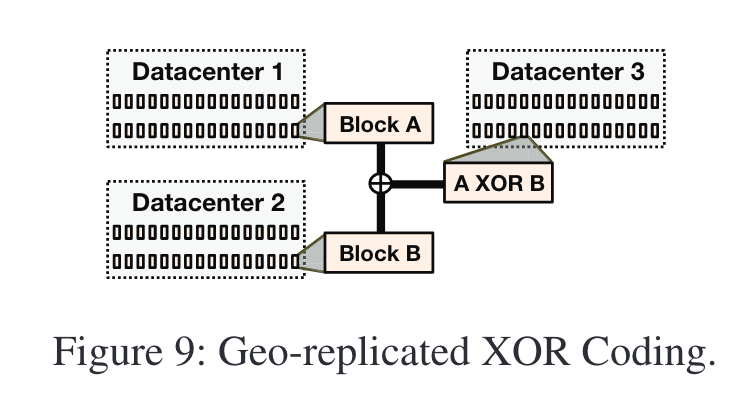

## 背景
Facebook 的 BLOB（Binary Large OBject）工作负载有以下特征：
- Write Once Read Many
- 冷热分区
- 不可变数据

*Finding a needle in haystack Facebook's photo storage* 的目标是高 IOPS，但存储成本高。面对**冷热分区**的工作负载，Facebook 设计了暖存储系统 f4，专为第存储成本和高容错设计，填补 Facebook BLOB 存储系统的最后一块拼图。

Facebook BLOB 存储系统主要要思考三个问题：
1. 如何组合热存储 haystack 和暖存储 f4 为一个 BLOB 存储系统？
2. 如何实现低存储成本？
3. 如何实现高容错？

## BLOB 存储系统
Facebook 修改了 *Finding a needle in haystack Facebook's photo storage* 论文所示的 haystack 设计，包括：
- 将单一职责原则贯彻到底。旧 haystack 架构中，照片的转换（将照片转换为不同清晰度的多个版本）在 Store 中进行；新的 BLOB 存储系统专门设置了一个 Transformer Tier 负责照片的转换，解耦了存储与计算。
- 新增 journal 文件追踪 blob 的删除。旧 haystack 的设计中，needle（haystack volume 中存储 blob 一条记录）中有一个指示是否被删除的标记位；新的 BLOB 存储系统新增 journal 文件追踪 blob 的删除，数据文件（haystack volume）只负责存储 blob。
- 修改了 volume 的定义。旧 haystack 架构中，逻辑 volume 只是存储 blob；新 BLOB 存储系统的逻辑 volume 中包括 data 文件、index 文件和 journal 文件。旧 haystack 架构中的逻辑 volume 相当于新 BLOB 存储系统的 data 文件。

Facebook BLOB 存储系统使用专门的 Router Tier 路由请求：
- create 请求只路由给热存储 haystack。
- delete 请求根据条件路由给 haystack 或 f4。
- read 请求根据条件路由给 haystack 或 f4。

热存储 haystack 服务大部分请求，暖存储 f4 不服务 create 请求，只服务一部分 read/delete 请求。

BLOB 存储系统的 volume 分为 locked 和 unlocked 两种类型，unlocked 类型的 volume 允许 create 请求，locked 类型的 volume 只允许 read 和 delete 操作。locked 类型的 volume 对应热数据，unlocked 类型的 volume 对应冷数据。unlocked volume 大小超过 100GB 时转化为 locked volume，这也意味着热存储 haystack 的数据达到 100GB 时，冷却到 f4 中。

>[!INFO] 论文没有介绍热数据冷却的设计与实现。haystack 和 f4 的数据存储格式相同，因此可以猜测热数据冷却只需要简单地将 haystack 存储的数据倒入 f4 即可。

## f4 数据存储

f4 只存储了 data 和 index，blob 的删除情况（对应 haystack 的 journal）存储在外部数据库中。f4 存储管理（部署和回滚）的基本单位是 cell，每个 cell 包含 14 个 rack，每个 rack 有 15 个 host，每个 host 有30 个 4TB 的磁盘。

data 文件逻辑上划分为 10 个 block，每个 block 使用 Reed-Solomon 码编码并存储，同时使用 Reed-Colomon 码生成 4 个 parity blok。data 文件被划分成多个 block，因此一个 block 可能包含许多 blob。

block 大小被设置的很大，典型的大小是 1GB，这带来了两个好处：
1. 降低 blob 跨 block 的概率。
2. 减少需要维护的 block 元数据。
>[!NOTE] 第一点类似于内存对齐，第二点类似于 OS 的大页，*The Google file system* 也用了类似设计减少 metadata。

EC 检验是实现高容错和低存储成本的关键，这种容错策略对集群拓扑提出了要求，后面会详细介绍。

## f4 集群架构

Rebuilder 负责故障检测和恢复，Coordinator 复制协调 Rebuilder 以及运行 Balance 任务。Name 节点记录 block 和 Storage 节点的映射关系。Storage 节点向外提供了 Index API 和 File API，Index API 向外提供本 Storage 节点存储的 volume 子集的数据位置查询服务，File API 提供数据访问能力。

>[!INFO] 似乎可以将 rebalance 放在单独的 rebalancer 组件，coordinator 只复制协调。

f4 集群架构的重点是 Backoff Node，Backoff Node 提供 BLOB 层面的在线数据重建能力。Router Tier 在 Storage Node 访问（R1-R3）失败后，向 Backoff Node 发出 read 请求（R4），Backoff Node 去访问失败的 block 的伙伴盘（companion block）和校验盘（parity block），重建损坏的 BLOB 并返回结果。

除了 Backoff Node 的在线数据重建，Rebuilder Node 还在后台定期扫描磁盘并重建损坏的块。

>[!NOTE] Rebuilder Node 主动恢复数据，Backoff Node 被动恢复数据；Rebuilder Node 恢复 block，Backoff Node 恢复 blob。

## 容错

f4 使用 erasure code 技术实现 block 层面的容错，在此之上，通过将 block 分散在不同的故障域实现磁盘、主机和机架三级容错。

最理想的情况下，f4 将一个 strip 的 14 个 block 分别存储在不同机架的不同的主机的不同的磁盘上。无论哪个层次的故障域发生故障，只要故障的故障域不超过 4/14，就能够利用 erasure code 恢复。

这种基于故障域的策略对集群的拓扑结构提出了要求，理想的集群拓扑结构应该至少包含 14 个机架，将 block 分布在不同的机架上自然就实现了主机和磁盘级别的容错。在集群拓扑无法满足理想的故障域要求时，f4 使用 best-effort 的容错策略，尽可能将 block 分布在不同的主机的不同的磁盘上。

基于故障域的策略需要管理集群配置表（包含集群拓扑的配置表），尽管 f4 论文没有详细介绍集群配置表的管理，但根据架构可以猜测使用中心化的方式管理，可能由 Coordinator Node 管理。与此相反，*Ceph reliable, scalable, and high-performance distributed storage* 使用彻底分布式地方式管理集群配置表。

f4 使用跨数据中心的 XOR 校验实现数据中心级别的容错。f4 把数据存储在两个数据中心，并将两个数据中心不同的 volume 的块作为伙伴块，在另一个数据中心存储这两个块 XOR 后的结果。跨数据中心的 XOR 校验要求至少 3 个数据中心。任意数据中心故障后，f4 都能从另外两个数据中心取出伙伴块和 XOR 校验块恢复数据。

>[!NOTE] f4 异地复制策略中，两个数据中心存储的是不同的数据，数据是无副本的，通过跨数据中心的 XOR 实现容错。这种策略牺牲了发生数据中心故障时的 BLOB 吞吐量，但降低了有效复制因子。

## 低存储成本

f4 低存储成本的秘诀是 erasure code 和异地 XOR 校验。

haystack 的所有数据都是用三副本，因此有效复制因子（*effective replication factor*，即一份数据实际消耗的存储量）是 3。

f4 的数据块使用 Reed-Colomon 码实现容错，14 个块，其中 4 个块是校验块，10 个是数据块，因此数据中心内的有效复制因子是 14/10=1.4。

使用跨数据中心的双副本策略时，f4 的有效复制因子是 (1.4\*2)/1=2.8。使用跨数据中心的 XOR 校验策略时，数据无副本，XOR 数据中心同样适用 Reed-Colomon 码，因此有效复制因子是 (1.4*2+1.4)/2=2.1。

>[!NOTE] 只有 data 文件使用 Reed-Colomon 码和异地 XOR 校验。index 文件因为数据量比较小，在本地 cell 使用三副本策略，并将三个副本备份到远程 cell（另一个数据中心）。

## 经验
- 组件职责分离
- 组件可独立水平拓展
- Erasure code 和 XOR 实现低存储成本。

## Q&A

- [x] 为什么要分离 index 和 data，而不像 *Finding a needle in haystack Facebook's photo storage* 一样只将 index 用作 checkpoint？

    为了实现高效的 head 和 list 操作。

- [x] 为什么要为 haystack 添加 journal file？

    也许是为了解耦修改和删除。f4 不可修改可删除，如果仍然通过 index 追踪 BLOB 的删除，f4 要被迫管理可修改的数据。

- [x] f4 不使用 stripe 策略将数据分散到不同的磁盘，它如何应对热点？

    论文提到缓存和 haystack 服务大多数请求，f4 可能认为热点可以忽略。

- [x] 为什么 create 出错则直接失败，delete 出错则重试直到成功？

    create 出错后有 GC 兜底，GC 会删除创建出来的文件。delete 出错如果不重试到成功，就会出现 partial 的状态。

- [x] 暖存储 f4 和热存储 haystack 的区别在哪？

    1. f4 的存储成本更低。

    2. f4 的吞吐量更小。本地 cell 的 Backoff Node 在线数据恢复和异地 XOR 恢复策略都会降低吞吐量。

- [x] 为什么 *Evaluation* 一章认为故障的最坏情况是先坏磁盘？

    坏机架只会损坏 N 个 strip 中的 1 个 block，不会造成数据丢失。坏磁盘可能是坏一个 strip 中的 N 个block，会造成数据丢失。

- [x] 为什么 *Evaluation* 一章认为校验块先坏比数据块先坏更严重？

    因为恢复校验块需要计算 Reed-Colomon 码，成本比回复耦数据块更高。

- [x] f4 如何应对坏盘?

    - BLOB 级别的在线重建

    - Cordinator  在后台协调 rebuilder node 重建 block。

- [x] f4 如何避免 rebuild/rebalance 导致内部流量暴增影响服务？

    限制 rebuild/rebalance 的资源消耗

- [x] Facebook 如何整合 haystack 和 f4？

    1. 相似的数据格式方便 f4 导入 haystack 的数据。

    2. 将 haystack 和 f4 视作 router tier 的后端，router tier 负责将 BLOB 路由到对应后端的 logical volume。

    3. controller 统一管理 haystack 和 f4。

- [x] Facebook 存储系统是否存在冗余？

    存在。router tier 有索引，haystack 和 f4 也有自己的索引。

- [x] 数据损坏是否会影响用户读取？

    不影响。router tier 会读取该 blob 的其他伙伴并构建损坏的数据，然后返回给用户。backoff node 同时进行在线重建。

## References
- *f4: Facebook’s Warm BLOB Storage System.pdf*
