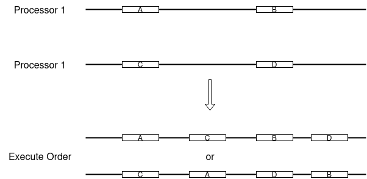
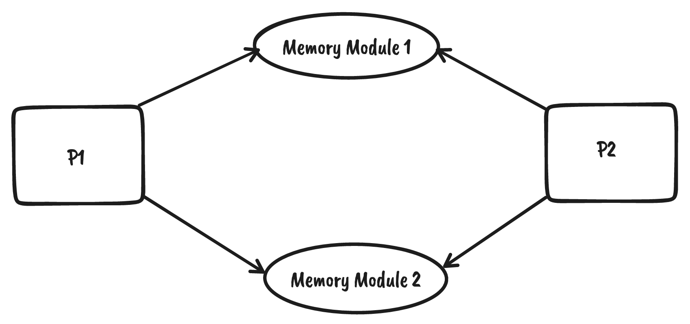

## TL;DR

- SC(Sequential Consistency)：任何执行的结果看起来就像所有处理器都顺序执行，并且单个处理器按照程序指定次序执行。

- 每个处理器都是顺序的，不意味着整个多核系统是顺序一致的。

- SC 是一个定义在内存访问上的偏序。

- 为了实现 SC，处理器需要满足两个条件：

  - 处理器按照程序次序发起请求。发起请求包括进入内存模块的队列。

  - 内存模块按照 FIFO 次序响应请求。

- SC 虽然符合人类直觉，但限制了处理器性能。现代处理器实现的是更弱的一致性模型。

## 解读

_How to Make a Multiprocessor Computer That Correctly Executes Multiprocess Program_ 是 [Leslie Lamport](http://lamport.azurewebsites.net/) 在 1979 年发表的一篇著名论文，论文明确定义了多核处理器的*顺序一致模型*（_Sequential Consistency_，简称 SC），并给出了实现方法。

在单核系统上，程序的正确执行次序是顺序执行，即按照程序指定的次序执行指令。在多核系统上，运行在多个核心上的程序的正确执行次序是什么？直观地看，是每个核心都顺序执行，并且核心间交替执行，这种模型就是顺序一致模型。

方框表示指令，横轴表示次序。在处理器 1 上，先执行 A 再执行 B，处理器 2 上先执行 C 再执行 D。最终用户看到的执行次序是平移两个轴合并起来（保持相对次序，交替执行）。两种（不只两种）可能的次序如下。



顺序一致模型不仅局限于多核处理器。从更普遍的角度看，顺序一致模型是分布式系统中符合用户直觉的一致性模型。多核处理器是分布式系统的一个特例。将上图的处理器替换为“节点”，将指令替换为”事件”，就可以得到分布式系统下的顺序一致性语义。事实上，本文中作者就使用了”事件“（_event_）一词，而非局限在处理器指令。

论文基于以下模型讨论处理器设计：数据存储在内存模块中，处理器内存模块发起内存访问请求，内存模块响应请求。



论文中的 _process_ 一词译为*进程*，但不指操作系统的”进程“，更像是*线程*或”运行在处理器上的逻辑流“。_multiprocessor_ 译为多处理器。

## 译文

<center><b>How to Make a Multiprocessor Computer That Correctly Executes Multiprocess Programs</b></center>

<center>LESLIE LAMPORT</center>

**摘要——许多大型顺序计算机以不同于程序指定的次序执行操作。正确执行产生的结果与按照程序次序执行得到的结果相同。对于一个多处理器系统，每个处理器的正确执行不能保证整个程序的正确执行。为了保证计算机正确执行多进程程序，必须添加额外条件。**

**关键词——计算机设计，并发编程，硬件正确性，多处理，并发处理。**

---

高速处理器可能以不同于程序指定的次序执行指令。如果满足以下条件，则执行是正确的：执行的结果和按照程序次序执行的结果相同。满足这个条件的处理器可以称为*顺序的*（_sequential_）。考虑一个多处理器、统一内存访问的计算机。习惯性的做法是为这种计算机设计并证明满足以下条件的多进程算法[1]-[3]：任何执行的结果看起来就像所有处理器都顺序执行，并且单个处理器按照程序指定次序执行。满足这种条件的多处理器称为*顺序一致的*（_sequentially consistent_）。每个处理器的顺序执行不能保证整个计算机是顺序一致的。在这个简短的笔记中，我们描述一种通过带内存模块的、相连的顺序处理器实现顺序一致的多处理器系统的方法。

我们假设计算机由多个处理器和内存模块组成，所有专门的通信寄存器可以被认为是单独的内存模块。我们唯一考虑的处理器操作是对内存模块的读写请求（_load and store requests_）。我们假设处理器发送一系列读写请求（处理器有时必须等待请求被执行，但这和我们无关）。

我们通过一个简单的两进程互斥协议来阐明这个问题。每个进程都包含一个*临界区*（_critical seciton_），这个协议的目的是确保在任何时刻只有一个进程可以执行临界区。这个协议如下：

```
process 1
---------
    a := 1;
    if b = 0 then critical section;
                    a := 0
             else    ...    fi
process 2
---------
    b : = 1;
    if a = 0 then critical section;
                    b := 0
             else    ...    fi
```

else 语句包含一些可以确保最终访问到临界区的机制，但这和我们的讨论无关。很容易证明这个协议保证了对临界区的互斥访问。（设计一个证明是非常好的使用如 [2] 和 [3] 中的断言技术的练习，这留给读者完成。）因此，当这个两进程程序被顺序一致多处理器执行时，两个进程不可能同时执行他们的临界区。

我们首先观察到顺序处理器可能以任意次序执行进程 1 的`b := 1`和`fetch b`操作。（当只考虑进程 1 的程序自身时，以哪种次序执行两个操作不重要。）显然先执行`fetch b`操作会导致错误——两个进程可以同时执行临界区。这启示了我们对多处理器计算机的第一个要求。

_要求 R1: 每个处理器按程序指定的次序发起内存请求。_

满足 R1 很复杂，因为只有计算出了值才能存储它。处理器经常在知道先前的写请求具体的值之前，就已经准备好发送读请求了。为了减少等待，处理器可以只发送写请求而不指定具体的值。当然，写请求不能被执行，直到它收到了要写的值。

要求 R1 不保证程序的正确执行。为了看到这一点，假设内存模块有多个端口，每个端口接收一个处理器（或 IO 信道）。让`a`和`b`分别存储于不同的内存模块，考虑以下事件序列：

1. 处理器 1 发送`a := 1`请求给它的内存模块 1 端口。此模块正忙于执行其他处理器（或 IO 信道）的操作。

2. 处理器 1 发送`fetch b`请求给它的内存模块 2 端口。此模块空闲，开始执行请求。

3. 处理器 2 发送`b := 1`请求给内存模块 2。这个请求在处理器 1 的`fetch b`请求完成后执行。

4. 处理器 2 发送`fetch a`请求给它的内存模块 1 端口。此模块仍然繁忙。

现在有两个操作等待内存模块 1 执行。如果处理器 2 的`fetch a`操作先执行，那么两个处理器可以同时进入临界区，互斥协议失败。如果内存模块使用轮转调度策略（round robin scheduling discipline）服务各端口，可能会发生这种错误。

这种情况下，仅在内存模块 1 不按两请求进入队列的次序服务时发生错误。这提出了以下要求。

_要求 2: 任何处理器发送到某内存模块的内存请求都从它的 FIFO 队列被服务_。发送内存请求包括进入队列。

条件 R1 隐含一个处理器在当前请求进入队列之前，不能发送任何进一步的内存请求。因此处理器在队列满时等待。如果两个或多个处理器同时尝试发送请求到队列，那么他们被服务的次序不重要。

_注意_。如果读操作请求的是已存在于队列中的写请求的内存位置上的值，这个读请求不需要进入队列。可以直接从队列中返回最近一次写请求的值。

要求 R1 和 R2 共同确保，每个处理器是顺序的，则整个多处理器计算机是顺序一致的。为了证明这一点，引入一个内存请求上的关系`->`。定义`A->B`当且仅当 **1)** A 和 B 是同一处理器发送的，并且 A 先于 B 发送；或 **2)** A 和 B 被发送到相同内存模块，并且 A 先于 B 进入队列（因此先于 B 执行）。很容易看到，R1 和 R2 隐含了`->`是内存请求上的偏序。基于每个处理器的顺序性，可以证明以下结论：每个读取和写入操作读取或写入好像所有操作都以任何顺序顺序执行时的值，这样`A->B`意味着 A 在 B 之前执行。

R2 要求内存模块必须按 FIFO 次序服务请求。这隐含了内存模块必须在队首请求是写请求且值未确定时保持空闲。可以弱化条件 R2 以允许内存模块在此情形下服务其他请求。我们只要求所有对*同一内存单元*（_the same memory cell_）的请求按进入队列的次序服务。不同内存单元的请求可以乱序服务。因为这种服务策略逻辑等价于把内存单元当成一个拥有自己队列的内存模块，仍然保证顺序一致性。（这些模块可能共用某些硬件，这会影响服务请求的速率和队列容量，但不影响顺序一致性这一逻辑属性。）

保证顺序一致性所需的要求排除了一些可用于加速单个顺序处理器的技术。对于一些应用，实现顺序一致性的好处可能不足以抵偿降低处理器性能的代价。在这种情况下，人们必须意识到不能依靠传统的设计多进程算法的方法来设计正确执行的程序。 必须在最底层设计用于同步处理器的协议，验证它们的正确性是一项艰巨的任务。

---

**REFERENCES**

[1] E. W. Dijkstra, "Hierarchical ordering of sequential processes," Acta Informatica, vol. 1, pp. 115-138, 1971.

[2] L. Lamport, "Proving the correctness of multiprocess programs," IEEE Trans. Software Eng., vol. SE-3, pp. 125-143, Mar. 1977.

[3] S. Owicki and D. Gries, 'Verifying properties of parallel programs: an axiomatic approach," Commun. Assoc. Comput. Mach., vol. 19, pp. 279-285, May 1976.
