## 译者序
[*Memory Barriers: a Hardware View for Software Hackers*](resources/memory-barriers-a-hardware-view-for-software-hackers.pdf)
是并发编程专家 Paul E. McKenney 的经典论文，该论文同时收录在他的著作 *Is Parallel Programming Hard, And, If So, What Can You Do About It?* 附录 C *Why Memory Barriers?* 中。

本文全文翻译该论文。

-----------

-----------

为什么中了邪的 CPU 设计者要让可怜的一无所知的软件设计者受内存屏障（memory barrier）的伤害？

简单地说，因为乱序内存引用可以带来更好的性能，所以需要用内存屏障在同步原语这类其正确操作依赖于排序的内存引用的东西中强制排序内存引用。

想得到这个问题更加详细的答案需要深入理解 CPU cache，尤其是 cache 正常工作的要求。以下章节：

1. 介绍 cache 的结构，

2. 描述缓存一致性（cache-coherency）协议怎样确保多个 CPU 最终对每个位置上的值达成共识。

3. 概括 store buffer 和 invalidate queue 如何帮助 cache 和缓存一致性能够协议实现高性能。

我们将看到内存屏障为实现高性能和可拓展性而带来的不可避免的坏处，这是 CPU 比 CPU 之间的连接和内存访问快几个数量级这一事实带来的坏处。

## Cache 结构

现代 CPU 远快于现代内存系统。2006 年的 CPU 可以每纳秒执行 10 条指令，却需要数十纳秒从主存中读取数据。速度上的不对称——超过两个数量级——导致了现代 CPU 上数 MB 大的 cache。图 1 所示的与 CPU 相连的 cache 通常可以在几个时钟周期内访问。

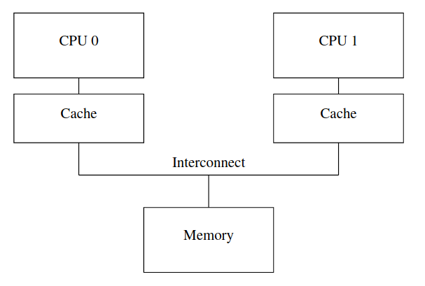

CPU cache 与内存中以定长块的形式流动的数据，称为“高速缓存行”（cache line）。缓冲行大小通常是 2 的 N 次方，从 16 字节到 256 字节不等。给定数据项第一次被给定 CPU 访问时，如果它不在那个 CPU 的 cache 中，导致发生一次”缓存未命中“（或者更具体地说，”启动未命中”或“热身未命中“）。缓存未命中（cache miss）意味着 CPU 将不得不等待（或”停顿“）数百个周期以便从主存中加载数据。然而，数据加载到 CPU cache 后，后续访问将在 cache 中发现它，因此可以全速运行[^1]。

一段时间后，数据会充满 CPU cache，后续未命中需要从 cache 中淘汰一个数据项以便为新读取的数据项腾出位置。这种缓存未命中是 cache 有限的容量导致的，称为”容量未命中“。然而，大部分 cache 即使没有满，也会淘汰数据项为新数据项腾出空间。这是因为大的 cache 实现为不带链的、固定大小的 hash 桶的硬件 hash 表（CPU 设计者叫它们”组“）。图 2 展示了 CPU cache 的结构。

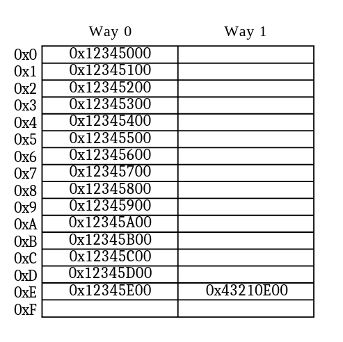

这个 cache 有 16 “组”（set），2 “路”（way），共 32 “行”（line）。每个条目包含一个 256 字节“缓存行”（256 字节对齐的内存块）。这个缓存行有点大，但让十六进制算术更简单。在硬件术语中，这是一个两路组相联 cache，类似于一个有 16 个桶、每个桶的哈希链最多含两个元素的软件哈希表。大小（这个例子中的 32 个缓存行）和相联度共同称为 cache 的“几何结构”。因为 cache 由硬件实现，所用的哈希函数极其简单：从内存地址中提取 4 比特。

在图 2 中，每个方框对应一个 cache 条目，每个 cache 条目包含一个 256 字节缓存行。然而，缓存条目可以为空，就像图片中的空方框展示的那样。剩下的方框都用它们包含的缓存行对应的内存地址标记。因为缓存行必须是 256 字节对齐的，每个地址的低   8 位都是 0，硬件哈希函数的选择意味着下一个相邻的 4 比特匹配缓存行编号。

程序的代码位于地址 0x43210E00 到 0x43210EFF，且这个程序顺序访问 0x12345000 到 0x12345EFF 的数据。假定此程序现在访问地址 0x12345F00。这个位置哈希到缓存行 0xF，并且这一行的两路都是空的，所以可以容纳对应的 256 字节缓存行。如果此程序访问位置 0x1233000，哈希到 0x0，路 1 可以容纳对应的缓存行。然而，如果程序访问位置 0x1233E00，哈希到 0xE，其中一个已存在的缓存行必须被淘汰，以便为新缓存行腾出空间。如果之后访问被淘汰的缓存行，会导致缓存未命中。这种缓存未命中称为“相联度未命中”。

到目前为止，我们只考虑了 CPU 读数据项的情况。CPU 写数据时会发生什么？因为所有 CPU 都要同意给定数据项的值，在 CPU 写数据项前，必须先从其他 CPU 清除或“失效”（invalidate）它。只有失效完成后，CPU 才能安全地修改数据项。如果数据项在 CPU 的 cache 中是只读的，这种情况称为“写未命中”。只要 CPU 已经失效了其他 CPU 缓存中的数据项，就可以重复读写该数据项。

之后，如果某个其他 CPU 尝试访问这个数据项，会招致一次缓存不命中，这次是因为第一次的 CPU 为了写它而失效此数据项。因为这类缓存未命中通常是多个 CPU 使用此数据项通信（例如，锁是一个使用互斥算法在多个 CPU 间通信的数据项）导致的，称为“通信未命中”。

显然，必须非常小心地确保所有 CPU 维持一致的数据视图。对于所有读取、失效、写入操作，很容易想象到数据丢失或者（更糟糕的）不同 CPU 在自己的 cache 为同一数据项存储了冲突的值。下一节描述的“缓存一致性协议”避免了这种问题。

## 缓存一致性协议

缓存一致性协议管理缓存行状态以免出现数据不一致或丢失。缓存一致性协议可以非常复杂，包含数十种状态[^2]。但对于我们的目的，我们只需要考虑四状态 MESI 缓存一致性协议。

### MESI 状态

MESI 代表 modified、exclusive、shared 和 invalid 这四种可用状态。使用这种协议的  cache 因此除了物理地址和数据，还要为每个缓存行维护一个两比特状态“标签”（tag）。

处于 modified 状态的缓存行允许对应 CPU 写入，并且保证对应的内存不会出现在其他 CPU 的 cache。因此可以说 modified 状态的缓存行被对应 CPU “拥有”（own）。因为这一 cache 保存了此数据的唯一最新副本，这个 cache 负责最终写回内存或移交给其他 cache，并且必须在重用此缓存行保存其他数据前这样做。

exclusive 状态和 modified 状态非常相似，唯一的区别是缓存行没有被对应 CPU 修改，这也意味着此数据内存中的副本是最新的。因为这个 CPU 可以在任何时刻写回该缓存行而无需询问其他 CPU，也可以称处于 exclusive 状态的缓存行被对应 CPU 拥有。也就是说，因为内存中对应的值是最新的，这个缓存行可以丢弃这个值，无需写回内存或移交给其他 CPU。

处于 shared 状态的缓存行可能被复制到至少一个其他 CPU 的缓存中，因此不允许对应 CPU 不询问其他 CPU 直接写回内存。像 exclusive 状态一样，因为内存中对应的值是最新的，cache 可以直接丢弃该数据而无需写回内存或移交给其他 CPU。

处于 invalid 状态的缓存行是空的，或者说它没有保存数据。如果可能的话，新进入 cache 的数据会被放到处于 invalid 状态的缓存行。倾向这种方法是因为如果放到其他状态的缓存行，访问该行会导致一次昂贵的缓存未命中。

因为所有 CPU 必须维持对缓存行中数据一致的视图，缓存一致性协议提供了消息来协调系统中缓存行的移动。

### MESI 消息

上一节中描述的许多转换都需要 CPU 间通信。 如果 CPU 在单个共享总线上，则以下消息就足够了：

**Read**：read 消息包含要读取的 cache line 的物理地址。

**Read Response**：read response 消息包含更早的 read 消息请求的数据。read response 消息应该由内存或其他 cache 发起。例如，如果一个 cache 包含处于 modified 状态的数据，此 cache 必须提供 read response 消息。

**Invalidate**：invalidate 消息包含要失效的缓存行的物理地址。其他所有 cache 必须移除 cache 对应数据并响应。

**Invalidate Acknowledge**：CPU 接收到 invalidate 消息，必须在移除它的 cache 的指定数据后返回 invalidate acknowledge。

**Read Invalidate**：read invalidate 消息包含要读取的缓存行的物理地址，同时指示其他 cache 删除数据。因此，如名字所示，这是 read 和 invalidate 的结合。一个 read invalidate 消息同时需要一个 read response 和一系列 invalidate acknowledge 应答。

**Writeback**：writeback 消息包含要写回内存的地址和数据（并且可能在此过程中“窥探”到其他 CPU cache）。这个消息允许缓存根据需要淘汰处于 modified 状态的其他数据以腾出空间。

有趣的是，一个共享内存的多处理器系统真的是一个消息传递计算机。这意味着使用分布式共享内存的 SMP 集群使用消息传递在系统架构的两个不同级别上实现共享内存。

**快速测验 1:** 如果两个 CPU 并发地尝试失效同一缓存行会发生什么？

**快速测验 2:** 当大型多处理器中出现 invalidate 消息时，每个 CPU 都必须给出 invalidate acknowledge 响应。 由此产生的 invalidate acknowledge 响应“风暴”难道不会使系统总线完全饱和吗？

**快速测验 3:** 如果 SMP 机器真的使用消息传递，为什么还要费心设计 SMP（而不使用软件方式进行消息传递，用多个处理器构造分布式系统）？

### MESI 状态图

给定缓存行的状态随消息的发送和接收改变，如图 3 所示。

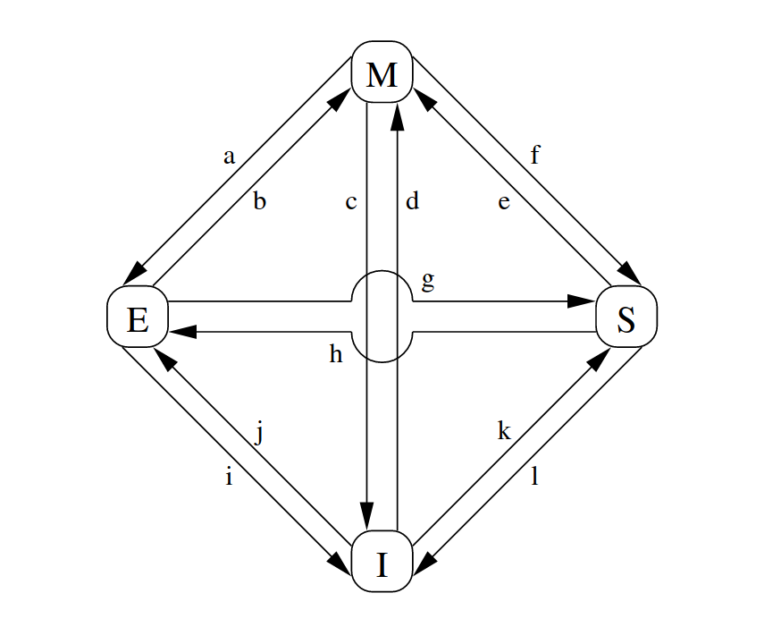

上图中的状态转移如下：

**Transition (a):** 缓存行写回内存，但 CPU 仍然把它保存在 cache 中，并且保留修改它的权力。此状态转移需要 writeback 消息。

**Transition (b):** CPU 写已独占访问的缓存行。此状态转移不需要发送或接收任何消息。

**Transition (c):** CPU 修改过的 cache 接收到 read invalidate 消息。CPU 必须失效它的局部副本，然后发送 read response 和 invalidate acknowledge 消息作为响应，并发送数据给请求者 CPU 指明它不再有局部副本。

**Transition (d):** CPU 在不存在于它的 cache 中的数据上执行原子 read-modify-write 操作。CPU 传输 read invalidate 消息，通过 read response 接收数据。CPU 可以在接收到全部 invalidate acknowledge 响应后完成状态转换。

**Transition (e):** CPU 在它 cache 中的只读数据上执行原子 read-modify-write 操作。CPU 必须响应 invalidate 消息，必须在完成传输前等待所有 invalidate acknowledge 消息。

**Transition (f):** 其他一些 CPU 读取缓存行，缓存行由此 CPU 缓存提供，此 CPU 保留一份只读副本，可能之后写回内存。此状态转移接收 read 消息发起，CPU 返回包含数据的 read response 响应。

**Transition (g):** 其他一些 CPU 读取缓存行，缓存行由本 CPU 缓存或内存提供，可能之后写回内存。此状态转移由 read 消息发起，CPU 返回包含数据的 read response 响应。

**Transition (h):** CPU 认为它将要写入一些数据项到它的缓存行中，因此发送 invalidate 消息。CPU 在接收到全部 invalidate acknowledge 响应之前，不能完成状态转换。另外，其他所有 CPU 通过 writeback 消息淘汰该缓存行，所以此 CPU 是最后一个缓存它的 CPU。

**Transition (i):** 其他一些 CPU 在此 CPU 持有的缓存行中的数据上执行原子 read-modify-write 操作，所以此 CPU 失效该缓存行。此状态转移接收 read invalidate messiage 发起，发送 read response 和 invalidate acknowledge 响应。

**Transition (j):** CPU 在不在它的 cache 中的数据上执行存储操作，因此传输 read invalidate 消息。CPU 在接收到 read response 和全部 invalidate acknowledge 响应前，不能完成状态转移。一旦存储完成，缓存行可能会通过 transiton (b) 转移到 modified 状态。

**Transition (k):** CPU 加载不在它缓存中的缓存行。CPU 传输 read 消息，接收到相应 read response 后完成状态转移。

**Transition (l):** 其他一些 CPU 加载此缓存行中的数据，但是缓存行同时被其他 CPU 持有（例如当前 CPU 的 cache）处于只读状态。此状态转移由接收 invalidate 消息发起，发送 invalidate acknowledge 响应。

**快速测验 4:** 硬件如何处理上面描述的延迟转换？

### MESI 例子

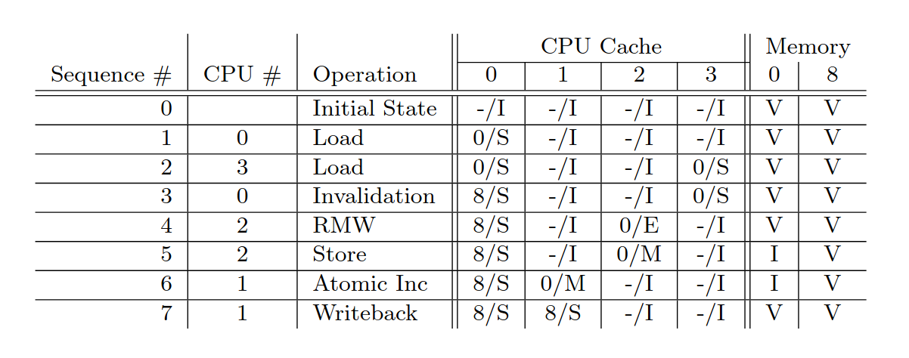

让我们从缓存行视角看这个例子，数据最驻留在内存地址 0 处，穿梭于四核系统中的单行直接映射（single-line direct-mapped）cache。表 1 展示数据流，第一列表示操作序列，第二列表示执行操作的 CPU，第三列表示执行的操作，第四列表示每个 CPU 的缓存行状态（MESI 状态紧跟内存地址），最后两列表示对应内存内容是否最新（最新为 V，否则为 I）。

初始时刻，CPU 缓存行处于 invalid 状态，数据在内存中。当 CPU 0 从地址 0 加载数据，CPU 0 的 cache 进入 shared 状态，并且内存中数据仍然有效。CPU 3 也从地址 0 加载数据，因此两 CPU 均进入 shared 状态，并且内存中数据仍然有效。之后 CPU 0 加载其他缓存行（从地址 8），通过失效强制淘汰 cache 中内存地址 0 上的数据，用地址 8 上的数据替代它。CPU 2 现在加载地址 0，因为 CPU 认为它很快就需要写此数据，因此使用 read invalidate 消息以获取独占的副本，失效 CPU 3 中的副本（尽管内存中的副本仍然是最新的）。下一步 CPU 2 执行它期待的写操作，状态改变为 modified。现在内存中的副本过时了。CPU 1 执行原子递增，使用 read invalidate 消息从 CPU 2 的 cache 中窥探到数据并失效它，因此 CPU 1 的 cache 处于 modified 状态（并且内存中的副本仍然过时）。最后 CPU 1 从缓存行读取地址 8 上的数据，使用 writeback 消息写回地址 0 上的数据到内存。

请注意，结束时某些 CPU 的 cache 中留有数据。

**快速测验 5:** 何种操作序列会让所有 CPU 的 cache 都进入到 invalid 状态？

## 写操作导致不必要的停顿

尽管图 1 所示的 cache 结构为给定 CPU 对给定数据项的重复读写提供了良好性能，但首次写数据项的性能相当差。请考虑图 4，它展示了 CPU 0 写 CPU 1 的 cache 持有的缓存行的时间线。因为 CPU 0 必须等待请求的缓存行到达，所以 CPU 0 必须停顿一段时间[^3]。

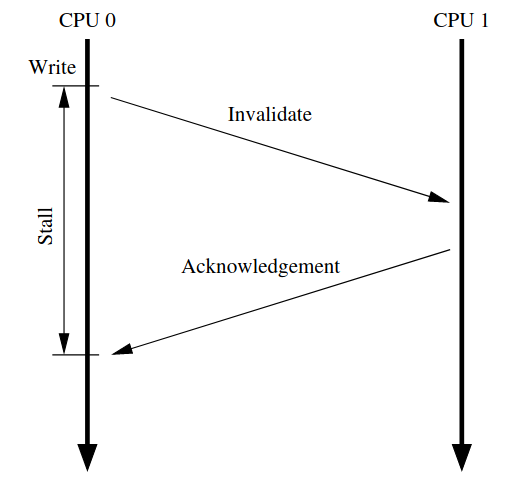

但是没有真正的理由强迫 CPU 0 停止这么长时间——毕竟，无论 CPU 1 发送的缓存行中有什么数据，CPU 0 都会无条件地覆盖它。

### Store Buffers

一种避免写操作导致的不必要的停顿的方式是在每个 CPU 与其 cache 间添加一个 store buffer，如图 5 所示。通过添加 store buffer，CPU 0 可以简单地将写操作记录在其存储缓冲区中并继续执行。 当缓存行最终从 CPU 1 移动到 CPU 0 时，数据将从 store buffer 移动到高速缓存行。

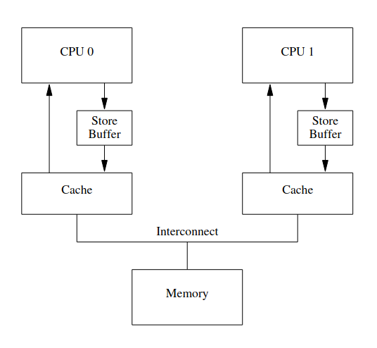

然而，必须解决由此带来的复杂问题，这将在接下来的两节介绍。

## Store Forwarding

要看到第一个复杂性，即违反自一致性（self-consistency），请考虑以下代码。变量`a`和`b`均初始化为 0，CPU 1 拥有`a`，CPU 0 拥有`b`：

```c
a = 1
b = a+1;
assert(b == 2);
```

人们期望断言成功。然而， 如果某人蠢到使用图 5 所示的极其简单的架构，那他会大吃一惊。这种系统可能会看到以下事件序列：

1. CPU 0 开始执行`a=1`。

2. CPU 0 在它的 cache 中搜索`a`，发现它不存在。

3. CPU 0 因此发送 read invalidate 消息以获得包含`a`的缓存行的独占所有权。

4. CPU 0 记录对`a`的写到它的 store buffer 中。

5. CPU 1 接收到 read invalidate 消息，传输此缓存行作为响应并从它的 cache 中移除该缓存行。

6. CPU 0 开始执行`b=a+1`。

7. CPU 0 从 CPU 1 接收缓存行，该缓存行中`a`的值仍然是 0。

8. CPU 0 从它的 cache 中加载`a`，发现值是 0。

9. CPU 0 将其存储队列中的条目应用到新到达的缓存行，将其 cache 中的`a`值设置为 1。

10. CPU 0 把从`a`读出来的值 0 加 1，让后写到包含`b`的缓存中（我们假设 CPU 0 已经拥有`b`）。

11. CPU 0 执行`assert(b==2)`，断言失败。

问题在于我们有两份`a`的副本，一份在 cache 中，另一份在 store buffer 中。

这个例子打破了一个非常重要的保证，即 CPU 看它自己的操作就像按程序次序（program order）发生的那样。这一保证对软件人员来说太过反直觉，以至于硬件设计者心生怜悯实现了 store forwarding。每个 CPU 在执行读操作前，读取（或“窥探”）它的 store buffer，如图 6 所示。换句话说，CPU 的写操作被转发给它后序的读操作，无需经过 cache。


有了 store forwarding，上述操作序列的第 8 项将从 store buffer 中发现`a`的正确值 1，所以`b`的最终值就像期待的那样是 2。

### store buffer 和内存屏障

为了看到第二个复杂性，即违背全局内存次序，考虑以下代码，变量`a`和`b`都初始化为 0：

```c
void foo(void)
{
    a = 1;
    b = 1;
}

void bar(void)
{
    while (b == 0) continue;
    assert(a == 1);
}
```

假设 CPU 0 执行`foo()`，CPU 1 执行`bar()`。进一步假设包含`a`的缓存行值只存在于 CPU 1 的 cache，包含`b`的缓存行由 CPU 0 持有。操作序列可能如下：

1. CPU 0 执行`a=1`。缓存行不在 CPU 0 的 cache 中，因此 CPU 0 把`a`的新值放到它的 store buffer 中，发送 read invalidate 消息。

2. CPU 1 执行`while(b==0) continue`，但是包含`b`的缓存行不在它的缓存中。因此它发送 read 消息。

3. CPU 0 执行`b=1`。它已经拥有该缓存行（换句话说，该缓存行处于 modified 状态或 exclusive 状态），所以它写`b`的新值到缓存行。

4. CPU 0 接收到 read 消息，返回包含`b`最新值的缓存行给 CPU 1，并在自己的 cache 中标记该缓存行为为 shared 状态。

5. CPU 1 接收到包含`b`的缓存行并安装到它的 cache。

6. CPU 1 现在结束执行`while(b==0) continue`，因为它发现`b`的值是 1，它继续执行下一条语句。

7. CPU 1 执行`assert(a==1)`，因为 CPU 1 仍然看到`a`的旧值，断言失败。

8. CPU 1 接收到 read invalidate 消息，返回包含`a`的缓存行并从自己的 cache 中失效该缓存行。但一切都太晚了。

9. CPU 0 接收到包含`a`的缓存行，应用缓冲起来的写操作，但 CPU 1 的断言早已失败。

**快速测验 6:** 在上述步骤 1 中，为什么 CPU 0 需要发送 read invalidate 消息，而不是简单的 invalidate？

硬件设计人员无法直接提供帮助，因为 CPU 不知道哪些变量是相关的，更不用说它们如何相关了。因此，硬件设计者提供内存指令让软件告诉 CPU 这种关系。必须更新程序片段以包含内存屏障：

```c
void foo(void)
{
    a = 1;
    smp_mb();
    b = 1;
}

void bar(void)
{
    while (b == 0) continue;
    assert(a == 1);
}
```

内存屏障`smp_mb()`将导致 CPU 在应用后序写操作到缓存行前刷新 store buffer。CPU 可以在继续操作前停顿，直到 store buffer 为空，或 store buffer 保存后续写操作直到之前 store buffer 中的所有条目都被应用。

使用后一种手段，操作序列应该如下：

1. CPU 0 执行`a=1`。该缓存行不在 CPU 0 的缓存中，因此 CPU 0 将`a`的新值放到 store buffer 中，并发送 read invalidate 消息。

2. CPU 1 执行`while(b==0) continue`，但包含`b`的缓存行不在它的 cache 中。因此它发送 read 消息。

3. CPU 0 执行`smp_mb()`，标记 store buffer 中的所有条目（即`a=1`）。

4. CPU 0 执行`b=1`。它已经拥有该缓存行（换句话说，该缓存行处于 modified 状态或 exclusive 状态），但 store buffer 中有已标记的条目。因此，CPU 0 不直接写`b`的新值到缓存行，而是把它放到 store buffer 中（作为一个*未标记*的条目）。

5. CPU 0 接收 read 消息，返回包含`b`原始值的缓存行给 CPU 1。它把自己的缓存行标记为 shared 状态。

6. CPU 1 接收包含`b`的缓存行并安装到自己的 cache。

7. CPU 1 现在可以结束执行`while(b==0) continue`，但它发现`b`的值仍然是 0，继续重复`while`语句。`b`的新值被安全地隐藏在 CPU 0 的 store buffer 中。

8. CPU 1 接收 read invalidate 消息，返回包含`a`的缓存行给 CPU 0 并从自己的 cache 中失效该缓存行。

9. CPU 0 接收包含`a`的缓存行并应用缓冲起来的写操作，把该缓存行设置为 modified 状态。

10. 因为对`a`的写是`smp_mb()`标记的、 store buffer 中唯一的条目。CPU 0 现在可以写`b`的新值——除了包含`b`的缓存行现在处于 shared 状态。

11. CPU 0 因此发送 invalidate 消息给 CPU 1。

12. CPU 1 接收 invalidate 消息，失效自己 cache 中包含`b`的缓存行，并发送 acknowledgement 消息给 CPU 0。

13. CPU 1 执行`while(b==0) continue`，但 包含`b`的缓存行不在它的 cache 中。因此它发送 read 消息给 CPU 0。

14. CPU 0 接收 acknowledgement 消息，把包含`b`的缓存行放到 exclusive 状态。CPU 现在将`b`的新值写到缓存行。

15. CPU 0 接收 read 消息，返回包含`b`新值的缓存行给 CPU 1。CPU 也把自己的缓存行标记为 shared 状态。

16. CPU 1 接收包含`b`的缓存行并安装到自己的 cache。

17. CPU 1 现在可以结束执行`while(b==0) continue`，因为它发现`b`的值是 1，它继续执行下一条语句。

18. CPU 1 执行`assert(a==1)`，但包含`a`的缓存行不在它的缓存中了。一旦它从 CPU 0 获得这一缓存行，它就看到`a`的最新值，因此断言会通过。

就像你看到的一样，这一过程涉及大量步骤。即使是一些“加载 a 的值”这样看起来很简单的事，也会涉及 CPU 中的许多复杂步骤。

## 写序列导致不必要的停顿

不幸的是，每个 store buffer 都相对较小，意味着 CPU 执行一系列写操作会充满它的 store buffer（例如，如果所有写操作都导致缓存未命中）。那时，CPU 不得不再次等待失效完成以便在继续执行前排空 store buffer。相同的场景可能在内存屏障后立刻发生，后续所有 store 指令都必须等待失效完成，无论这些写操作是否造成缓存未命中。

可以通过让 invalidate acknowledge 消息更快到达优化这种情况。一种实现这一目的的方法是为每个 CPU 设置 invalidate 消息队列，或称为 invalidate queue。

### Invalidate Queues

invalidate acknowledge 消息耗时过长的一种原因是，它必须确保对应缓存行真的失效。如果 cache 繁忙，例如 CPU 正在密集地读写在其缓存内的数据，可能会延迟失效。另外，如果大量 invalidate 消息在短时间内到达，CPU 可能来不及处理它们，导致其他所有 CPU 停顿。

然而，CPU 不需要在发送 ACK 前真的失效缓存行。相反地，它可以排队这些 invalidate 消息，并让其他 CPU 明白它会在发送和该缓存行有关的消息前处理 invalidate 消息。

### invalidate queue 和 invalidate ACK

图 7 展示了一个带 invalidate queue 的系统。具有 invalidate queue 的 CPU 可以在将 invalidate 消息放入队列后立即确认该消息，而不必等到相应缓存行失效。当然，CPU 必须在准备发送 invalidate 消息前查看 invalidate queue——如果 invalidate queue 中有对应缓存行的条目，就不能立刻传输 invalidate 消息；它必须等待，直到处理完对应的 invalidate queue 条目。

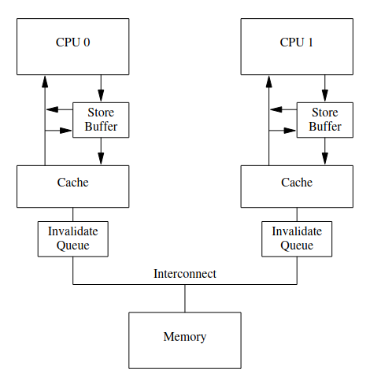

将条目放入 invalidate queue 本质上是 CPU 做出承诺，即在传输有关该缓存行的任何 MESI 协议消息之前处理该条目。

> **译者注**
>
> 前面说在发送 invalidate 消息前检查 invalidate queue 中是否有对应条目，这里说发送任何 MESI 消息都检查。以这里的说法为准。

只要对应数据结构不是高度竞争的，CPU 很少会因为这个承诺而引来不便。

然而，invalidate 消息可以缓冲在 invalidate queue 中这一事实，为内存乱序提供了更多机会。下一节讨论这点。

### invalidate queue 和内存屏障

让我们假设 CPU 排队失效请求，但立刻响应它们。这种方法最小化 CPU 执行写操作时观察到的缓存失效延迟（latency），但会击穿内存屏障，就像下面的例子展示的那样。

假设`a`和`b`的值都初始化为 0，`a`被只读复制（MESI shared 状态），`b`由 CPU 0 拥有（MESI exclusive 或 modified 状态）。然后假设以下代码片段中，CPU 0 执行`foo()`，CPU 1 执行函数`bar()`：

```c
void foo(void)
{
    a = 1;
    smp_mb();
    b = 1;
}

void bar(void)
{
    while (b == 0) continue;
    assert( a == 1);
}
```

可能的操作序列如下：

1. CPU 0 执行`a = 1`。对应的缓存行在 CPU 0 cache 中是只读的，所以 CPU 0 把`a`的新值放到它的 store buffer，发送 invalidate 消息以刷新 CPU 1 的对应缓存行。

2. CPU 1 执行`while(b==0) continue`，但包含`b`的缓存行不在它的 cache 中。因此它发送 read 消息。

3. CPU 1 接收 CPU 0 的 invalidate 消息，排队它并立刻响应。

4. CPU 0 接收 CPU 1 的响应，因此继续执行到上面第 4 行`smp_mb()`后，从它的 store buffer 移动`a`的值到缓存行中。

5. CPU 0 执行`b=1`。它已经拥有此缓存行（换句话说，缓存行处于 modified 或 exclusive 状态），因此它写`b`的新值到缓存行中。

6. CPU 0 接收 read 消息，传输包含`b`最新值的缓存行到 CPU 1，并把自己的缓存行标记为 shared 状态。

7. CPU 1 接收包含`b`的缓存行并安装到自己的 cache。

8. CPU 1 现在可以结束执行`while(b==0) continue`，因为它发现`b`的值为 1，继续执行下一条语句。

9. CPU 1 执行`assert(a==1)`，因为`a`的旧值仍然在 CPU 1 的 cache 中，断言失败。

10. 尽管断言失败，CPU 1 仍处理排队的 invalidate 消息，从自己的 cache 中失效包含`a`的缓存行。

**快速测验 7:** 在第 4.3 节第一个场景的第一步中，为什么发送 invalidate 消息而非 read invalidate 消息？CPU 0 不需要与`a`共享此缓存行的其他变量的值吗？

显然，如果这样做会导致内存屏障被忽略，那么加速 invalidate 响应就没有多大意义。 然而，内存屏障指令可以与 invalidate queue 交互，当 CPU 执行内存屏障时，它会标记当前在其 invalidate queue  中的所有条目，并强制后续读操作等待所有被标记的条目，直到所有被标记的条目都已应用于 CPU 的缓存。因此，我们可以给函数`bar`添加内存屏障：

```c
void foo(void)
{
    a = 1;
    smp_mb();
    b = 1;
}

void bar(void)
{
    while (b == 0) continue;
    smp_mb();
    assert(a == 1);
}
```

**快速测验 8:** 你说什么？？？为什么我们要在这放内存屏障，明明 CPU 不可能在`while`循环完成前执行`assert()`。

通过此修改，操作序列可能如下所示：

1. CPU 0 执行`a = 1`。对应缓存行在 CPU 0 cache 中是只读的，所以 CPU 0 把`a`的新值放到它的 store buffer，发送 invalidate 消息以刷新 CPU 1 的对应缓存行。

2. CPU 1 执行`while(b==0) continue`，但包含`b`的缓存行不在它的 cache 中。因此它发送 read 消息。

3. CPU 1 接收 CPU 0 的 invalidate 消息，排队它并立刻响应。

4. CPU 0 接收 CPU 1 的响应，因此继续执行到上面第 4 行`smp_mb()`后，从它的 store buffer 移动`a`的值到缓存行中。

5. CPU 0 执行`b=1`。它已经拥有此缓存行（换句话说，缓存行处于 modified 或 exclusive 状态），因此它写`b`的新值到缓存行中。

6. CPU 0 接收 read 消息，传输包含`b`最新值的缓存行到 CPU 1，并把自己的缓存行标记为 shared 状态。

7. CPU 1 接收包含`b`的缓存行并安装到自己的 cache。

8. CPU 1 现在可以结束执行`while(b==0) continue`，因为它发现`b`的值为 1，继续执行下一条语句，这条语句现在是内存屏障。

9. CPU 1 必须停顿直到它处理完 invalidate queue 中的所有消息。

10. CPU 1 现在处理队列中的 invalidate 消息，失效自己 cache 中包含`a`的缓存行。

11. CPU 1 执行`assert(a==1)`，因为包含`a`的缓存行不再 CPU 1 的 cache 中，它发送 read 消息。

12. CPU 0 使用包含`a`新值的缓存行响应此 read 消息。

13. CPU 1 接收包含值为 1 的`a`的缓存行，因此不会触发断言。

通过这么多 MESI 消息传递，CPU 终于到达了正确答案。这一节解释了为什么硬件设计者必须对缓存一致性优化极度谨慎。

## 读写内存屏障

在前面的章节中，内存屏障用于标记 store buffer 和 invalidate queue 中的条目。但在我们的代码片段中，`foo()`没理由对 invalidate queue 做任何事，`bar()`也没理由对 store buffer 做任何事。

因此，许多 CPU 架构提供更弱的内存屏障指令，它只执行两者中的一个。粗略地说，“读内存屏障”仅标记 invalidate queue，“写内存屏障”仅标记 store buffer，完全的内存屏障两者兼而有之。

读内存屏障的作用是，仅排序（order）执行它的 CPU 上的读操作，因此内存屏障前的所有读操作看起来在内存屏障后的所有读操作前完成。类似地，写内存屏障只排序执行它的 CPU 上的写操作，内存屏障前的所有写操作看起来在内存屏障后的所有写操作前完成。完全的内存屏障同时排序读、写操作，只作用于执行该内存屏障的 CPU 上。

如果我们使用读、写内存屏障更新`foo`和`bar`，代码看起来就像这样：

```c
void foo(void)
{
    a = 1;
    smp_wmb();
    b = 1;
}

void bar(void)
{
    while (b == 0) continue;
    smp_rmb();
    assert(a == 1);
 }
```

一些计算机甚至有更多种内存屏障，但理解这三种变体将有助于理解通用的内存屏障。

## 示例 内存屏障序列

这一节介绍一些诱人但难以察觉的内存屏障错误使用示例。 尽管它们中的许多示例大多数时候都能跑通，有的在特定 CPU 上是正确的，但如果你的目标是编写能运行于所有 CPU 上的代码，必须避免这种用法。为了帮助我们更好地看到这些难以察觉的错误，我们首先需要聚焦于一个 ordering-hostile 架构。

### ordering-hostile 架构

Paul 遇到过许多 ordering-hostile 计算机系统，但 hostility 的本质始终非常微妙，理解它需要对特定硬件的深入理解。与其选择特定的硬件供应商，并把读者拽进详尽的技术规范中，不如让我们设计一个神话般的最大限度反内存次序（memory-ordering-hostile）的计算机架构[^4]。

此硬件必须遵守以下次序约束 [McK05a, McK05b]:

1. 每个 CPU 总是认为它自己的内存访问按程序次序（program order）发生。

2. CPU 只在两写操作引用不同位置时乱序该操作。

3. 给定 CPU 的在读内存屏障（`smp_rmb()`）前的所有读操作，都被所有其他 CPU 认为先于该读内存屏障后的所有读操作。

4. 给定 CPU 的在写内存屏障（`smp_wmb()`）前的所有写操作，都被所有其他 CPU 认为先于该写内存屏障后的所有写操作。

5. 给定 CPU 的在完全内存屏障（`smp_mb()`）前的所有访问（读和写），都被所有其他 CPU 认为先于该内存屏障后的所有内存访问。

**快速测验 9:** 保证每个 CPU 按顺序看到自己的内存访问是否保证了每个用户级线程按顺序看到自己的内存访问？ 为什么能或者为什么不能？

想象一个大型非统一缓存架构（NUCA，non-uniform cache architecture），为了给每个节点公平分配互联带宽，在每个节点的连接接口提供队列，如图 8 所示。尽管给定 CPU 的内存访问被该 CPU 执行的内存屏障排序了，但给定 CPU 组的内存访问相对次序可以被乱序，就像我们将要看到的那样[^5]。

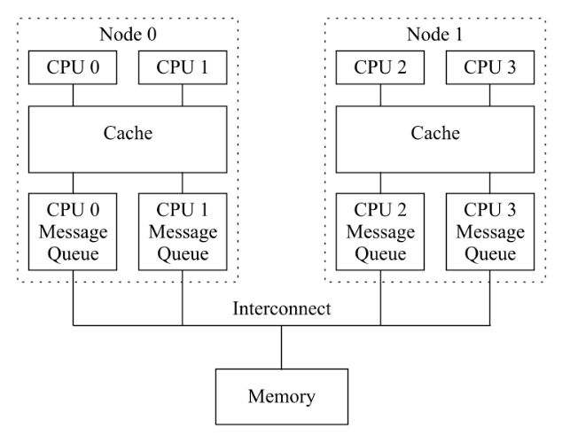

### 例 1

表 2 的三个代码片段由 CPU 0、1 和 2 并发执行。`a`、`b`和`c`都初始化为 0。

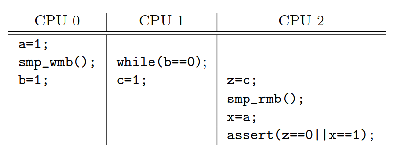

假设 CPU 0 最近经历了许多缓存未命中，所以它的消息队列已满。CPU 1 一直在自己的缓存中独占运行，因此它的消息队列为空。然后 CPU 0 对`a`和`b`的加载将立刻出现在节点 0 的缓存中（因此对 CPU 1 可见），但被阻塞在 CPU 0 之前的流量后面。相反地，CPU 1 对`c`的加载会穿越 CPU 1 空闲的队列。因此 CPU 2 会在看到 CPU 0 对`a`的赋值之前看到 CPU 1 对`c`的赋值，导致触发断言，尽管使用了内存屏障。

理论上，可移植的代码不能依赖于示例代码序列，然而实践中此示例代码可以在所有主流计算机系统上运行。

**快速测验 10:** 在 CPU 1 的`while`和对`c`的赋值间添加内存屏障可以修复这份代码吗？为什么行或为什么不行？

### 例 2

表 3 的三个代码片段由 CPU 0、1 和 2 并发执行。`a`和`b`均初始化为 0。


再次假设 CPU 0 最近经历了许多缓存未命中，因此它的消息队列已满。但 CPU 1 一直在自己的 cache 中独占运行，因此它的消息队列为空。之后 CPU 0 对`a`的赋值将立刻出现在节点 0 的 cache 中（因此对 CPU 1 可见），但被阻塞在 CPU 0 之前的流量后面。相反地，CPU 1 对`b`的加载会穿越 CPU 1 空闲的队列。因此 CPU 2 会在看到 CPU 0 对`a`的赋值之前看到 CPU 1 对`b`的赋值，导致触发断言，尽管使用了内存屏障。

理论上，可移植的代码不能依赖于示例代码序列，然而和之前一样，实践中此示例代码可以在所有主流计算机系统上运行。

### 例 3

表 4 的三个代码片段由 CPU 0、1 和 2 并发执行。`a`和`b`均初始化为 0。

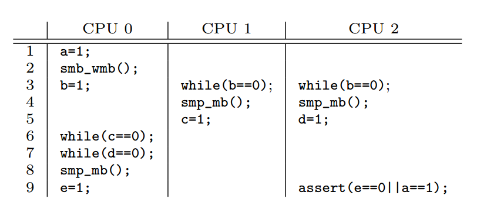

注意，CPU 1 和 CPU 2 在看到第 3 行上 CPU 0 对`b`的赋值前，无法执行到第 4 行。一旦 CPU 1 和 CPU 2 执行完第 4 行上的内存屏障，它们可以保证看到第 2 行上的内存屏障之前 CPU 0 的所有赋值。类似地，第 8 行上 CPU 0 的内存屏障和第 4 行上 CPU 1 与 CPU 2 的内存屏障成对匹配，因此 CPU 0 将不会执行第 9 行上对`e`的赋值，直到它对`a`的赋值对其他两个 CPU 可见。因此，可以保证*不会*触发第 9 行上 CPU 2 的断言。

**快速测验 11:** 假设 CPU 1 和 2 的第 3-5 行位于中断处理函数（signal handler）中，CPU 2 的第 9 行运行于进程层面。为了让代码正确工作，如果需要的话（换句话说，为了避免避免触发断言），要做出什么改变？

Linux 内核的`synchronize_rcu()`原语使用类似于示例代码的算法。

## 特定 CPU 的内存屏障指令

每个 CPU 都有自己古怪的内存屏障指令，如表 5 所示，这为可移植性带来了挑战。事实上，许多软件环境，包括 pthread 和 Java，直接禁止使用内存屏障，将程序员限制在互斥同步原语（mutual-exclusion primitive）中。在表 5 中，前四列表示该 CPU 是否允许四种可能的读写乱序组合。接下来两列指示是否允许在原子指令上重排读写操作。

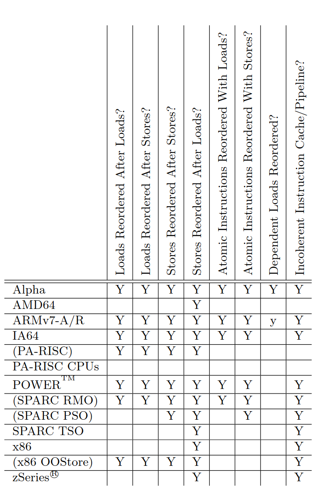

第七列，重排带依赖的读操作，需要解释一下，这将在以下涵盖 Alpha CPU 的部分中进行。 长话短说，Alpha 需要为链式数据结构的读者、写者加内存屏障。Alpha 可以在加载指针之前加载其指向的数据，虽然很奇怪但千真万确。如果你觉得我是胡编的话，可以看看 [http://www.openvms.compaq.com/wizard/wiz_2637.html](http://www.openvms.compaq.com/wizard/wiz_2637.html)。这种极其弱的内存模型的好处是，Alpha 可以使用更简单的 cache 硬件，这反过来在 Alpha 的全盛时期允许更高的时钟频率。

最后一列代表该 CPU 是否有非一致的指令 cache 和流水线。这种 CPU 需要为自修改代码（self-modifying code）执行专门的指令。

括号圈起来的 CPU 名代表该架构允许但实际上很少使用的模式。

通常，“对内存屏障说不”是非常合理的，但有一些环境，例如 Linux 内核需要直接使用内存屏障。因此 Linux 提供了一组精心挑选的最精简的内存屏障原语，如下所示：

- `smp_mb()`：只排序读和写操作的内存屏障。这意味着内存屏障之前的读写操作会先于任何内存屏障后的读写操作完成。

- `smp_rmb()`：只排序读操作的”读内存屏障“。

- `smp_wmb()`：只排序写操作的”写内存屏障“。

- `smp_read_barrier_depends()`强制排序依赖先前操作的操作。此原语在除 Alpha 外的平台上都是空指令（no-op）。

- `mmiowb()`强制排序全局自旋锁保护的 MMIO 写。此原语在所有平台上都不做任何操作，因为自旋锁中的内存屏障已经强制了 MMIO 上的次序。`mmiowb()`定义非空的平台包括一些（不是全部）IA64、FRV、MIPS 和 SH 系统。此原语相对较新，所以驱动比较少使用它。

`smp_mb()`、`smp_rmb()`和`smp_wmb()`原语还会强制编译器不进行任何可能让内存访问跨越内存屏障的优化。`smp_read_barrier_depends()`原语有类似的效果，但局限于 Alpha CPU。

这些原语只在 SMP 内核中生成代码，但每个原语都有 UP 版本（分别为`mb()`、`rmb()`和`read barrier depends()`），它们即使在 UP 内核中也生成代码。大多数情况下都应该使用`smp_`版本。然而， UP 版本在编写驱动时很有用，因为即使在 UP 内核中也要排序 MMIO 访问。没有内存屏障指令，CPU 和编译器都乐于重排内存访问，最好的情况是导致设备表现异常，可能让你的内核崩溃，某些情况下甚至会毁坏你的硬件设备。

绝大多数内核程序员只要使用这些接口，就不用担心不同 CPU 各个内存屏障的古怪之处。当然，如果你正在深入研究特定 CPU 架构的代码，那么所有的赌注都将落空。

更进一步，Linux 所有锁原语（自旋锁、读写锁、信号量、RCU 等等）都包含一切所需的屏障原语。所以如果你正在使用用这些原语的代码，你甚至不用担心 Linux 的内存排序原语。

也就是说，深入了解每个 CPU 的内存一致性模型在调试时非常有帮助，更不用说在编写特定于架构的代码或同步原语时了。

此外，只有一点点知识是非常危险的事。想象你有很多知识时可以造成的破坏！对于哪些希望了解更多 CPU 内存一致性模型的人，下一节介绍那些最受欢迎最著名的 CPU。尽管没有任何东西可以代替阅读 CPU 文档，这一节提供了不错的概览。

### Alpha

花这么多笔墨介绍一款已经死掉的 CPU 看起来很奇怪，但 Alpha 非常有趣，它使用最弱的内存模型，最激进地乱序内存操作。Linux 内存排序原语必须在包括 Alpha 的所有 CPU 上运行。因此，理解 Alpha 对 Linux 内核黑客出奇的重要。

图 9 展示了 Alpha 和其他 CPU 的差异。第 9 行的`smp_wmb()`保证第 6-8 行的元素初始化在第 10 行该元素被添加到列表中前执行，因此这个无锁查找将正确工作。也就是说，它保证在除 Alpha 外的所有 CPU 上正常工作。


Alpha 使用极弱的内存模型，以至于图 9 第 20 行上的代码可以看到前面在第 6-8 行之前旧的垃圾值（old garbage value）。

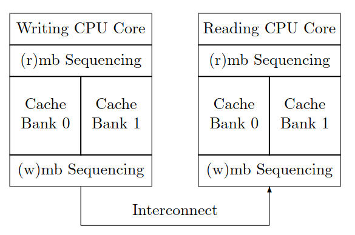

图 10 展示了为什么会在带分区 cache 的激进的并行机器上发生这种情况，交替的缓存行由不同的 cache 分区处理。假设链表头`head`由 cache blank 0 处理，新元素由 cache blank 1 处理。在 Alpha 上，`smp_wmb()`将保证图 9 第 6-8 行执行的 cache 失效在第 10 行执行前到达 interconnect，但完全不保证新值到达 CPU 核心的次序。例如，执行读操作的 CPU 的 cache blank 1 非常繁忙，但 cache blank 0 空闲。这会导致新元素的缓存失效被延迟，因此该 CPU 读取到指针的新值，但看到新元素在它缓存中的旧值。如果你觉得我是胡编的话[^6]，再回头看看前面我提到的网站。

有人会在指针读取和解引用间放一个`smp_rmb()`原语。然而，这给那些在读侧尊重数据依赖（respect data dependencies on the read side）的系统（例如 i386、IA64、PPC 和 SPARC）带来了不必要的开销。`smp_read_barrier_depends()`原语在 Linux 0.26 引入，用于消除这些系统上不必要的开销。该原语可以如图 11 的第 19 行所示的那样使用。

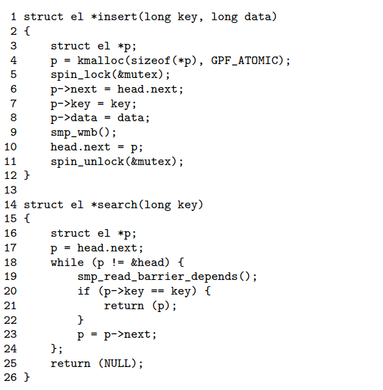

可以实现一个软件屏障来替代`smp_wmb()`，它强制所有执行读操作的 CPU 按序观察到 CPU 的写操作。然而，这一方法在 Linux 社区看来会给极弱内存序的 CPU 带来过大开销。可以通过发送核间中断（IPI）给其他所有 CPU 实现此软件屏障。收到这种 IPI 后，CPU 执行内存屏障指令，实现内存屏障击落（memory-barrier shootdown）。需要额外的逻辑避免死锁。当然，尊重数据依赖的 CPU 可以直接定义这种屏障为`smp_wmb()`。随着 Alpha 日落西山，Linux 社区将来可能会重新考虑这种方法。

Linux 内存屏障用 Alpha 指令命名，所以`smp_mb()`是`mb`，`smp_rmb()`是`rmb`，`smp_wmb()`是`wmb`。Alpha 是唯一`smp_read_barrier_depends()`是`smp_mb()`而非空指令的 CPU。

关于 Alpha 的更多细节，参考它的参考手册 [SW95]。

### AMD64

AMD64 兼容 x86，最近更新了它的内存模型 [Adv07] 以强制执行实际已经实现了一段时间的更严格的内存序。Linux `smp_mb()`的 AMD64 实现是`mfence`，`smp_rmb()`是`lfence`，`smp_wmb()`是`sfence`。理论上可以放宽它们，但所有的放宽都必须考虑 SEE 和 3DNOW 指令。

### ARMv7-A/R

ARM 系列 CPU 在嵌入式应用，尤其是在功率受限型应用例如手机中非常流行。尽管如此，ARM 的多处理器实现已经超过五年历史了。它的内存模型类似于 Power（见 7.6 节，但 ARM 使用不同的内存屏障指令 [ARM10]）：

1. `DMB`（data memory barrier，数据内存屏障）让指定类型的操作看起来就像在后序所有同类型操作前完成。操作的“类型”可以是所有操作或仅限于写操作（类似于 Alpha 的`wmb`和 POWER `eieio`指令）。此外，ARM 允许缓存一致性具有以下三个范围之一：单个处理器、处理器的子集（“inner”）和全局（“outer”）。

2. `DSB`（data synchronization barrier，数据同步屏障）让指定类型的操作在后序（任何类型）操作执行前实际完成。操作的“类型”和`DMB`相同。`DSB`指令在早期 ARM 架构中称为`DWB`（drain write buffer 或 data write barrier，随你选）。

3. `ISA`（instruction synchronization barrier）刷新 CPU 流水线，所以`ISB`后的所有指令只在`ISB`完成后取指（fetch）。例如，如果你正在编写自修改程序（例如 JIT），你需要在生成代码并执行它前执行`ISB`指令。

所有这些指令都不完全匹配 Linux `rmb()`原语的语义，因此必须用完整的`DMB`实现它。DMB 和 DSB 指令对障碍之前和之后的访问顺序进行了递归定义，其效果类似于 POWER 的累积性（cumulativity）。

ARMv7 和 POWER 内存模型的一大区别是 POWER 同时尊重数据依赖和控制依赖，而 ARMv7 只尊重数据依赖。可以从下面代码片段（在前面的 4.3 节讨论过）看出这两大 CPU 家族的差异：

```c
void foo(void)
{
    a = 1;
    smp_wmb();
    b = 1;
}

void bar(void)
{
    while (b == 0) continue;
    assert(a == 1);
}
```

第 10 行和第 11 行之间存在控制依赖。该控制依赖导致 POWR 在这两行间插入隐式的内存屏障，而 ARM 允许第 11 行在第 10 行完成前[^7]投机执行。另一方面，这两种 CPU 都尊重以下代码中的数据依赖：

```c
int oof(void)
{
    struct el *p;

    p = global_pointer;
    return p->a;
}
```

这两种 CPU 都会在第 5、6 行放置一个隐式内存屏障，避免第 6 行看到`p->`初始化前的值。当然，一切都假设编译器不重排这两行。

### IA64

IA64 提供弱一致性模型，所以没用显式内存屏障指令时，IA64 有权随意乱序内存访问 [Int02b]。IA64 有一个叫做`mf`的内存栅栏指令，但也有“半内存屏障”指令修饰符用于加载、存储和一些原子指令 [Int02a]。修饰符`acq`阻止后面的内存引用指令乱序到`acq`之前，但允许前面的内存引用指令被乱序到`acq`之后，如图 12 所示。类似地，修饰符`rel`阻止前面的内存引用指令乱序到`rel`之后，但允许后面的内存引用指令被乱序到`rel`之前。

这些半内存栅栏对关键区（critical section）非常有用，因为可以安全地推送操作到关键区，但让它们溢出可能是致命的。作为拥有该属性的唯一的 CPU，IA 64 定义了 Linux 的和锁的获取与释放相关的内存次序语义。


IA64 `mf`指令用于 Linux 内核`smp_rmb()`、`smp_mb()`和`smp_wmb()`原语。喔，尽管有相反的谣言，但`mf`助记词确实代表“内存栅栏”（memory fence）。

最后，IA64 为“释放”（release）操作提供了全序，包括`mf`指令。这提供了传递性，假设所有涉及的代码片段都正确使用了内存屏障，如果给定代码片段观察到之前发生的某访问，任何之后的代码片段也能看到之前那个访问。

### PA-RISC

尽管 PA-RISC 架构允许完全乱序读写操作，实际的 CPU 完全有序 [Kan96]。这意味着 Linux 内核的内存排序语义不用生成代码，然而，要用 gcc `memory`属性禁止编译器优化，因为这可能会跨过内存屏障重排代码。

### POWER/Power PC

POWER 和 POWER PC® CPU 家族有一系列内存屏障指令 [IBM94, LSH02]：

1. `sync`让前面的操作看起来在后序所有操作开始执行前完成。因此该指令相当昂贵。

2. `lwsync`（light-weight sync）既排序匹配后序读、写操作的读操作，也排序写操作。然而，它不排序匹配后序读操作的写操作。有趣的是，lwsync 指令强制执行与 zSeries 和 SPARC TSO 相同的排序。

3. `eieio`（意为强制 IO 顺序执行（enforce in-order execution of IO），如果你疑惑这个名字的话）强制前面所有可缓存的写操作看起来在后序所有写操作前完成。然而，对可缓存内存的写和不可缓存内存的写分别排序，意味着`eieio`将不强制 MMIO 写先于自旋锁释放。

4. `isync`强制前面所有指令看起来在后面所有指令开始执行前完成。这意味着前面的指令必须执行到所有可能触发的 trap 发生或保证不发生，并且这些指令的所有副作用（例如页表的改变）可被后序指令观察到。

不幸的是，这些指令都不完全符合 Linux `wmb()`原语，它要求排序*所有*写操作，但不需要`sync`指令的其他高开销动作。但别无选择：`mb()`和`wmb()`的 ppc64 版本定义为轻量级`sync`指令。然而，Linux 的`smp_wmb()`指令从来不用于 MMIO（因为不论如何，UP 和 SMP 内核上的驱动必须小心谨慎地排序 MMIO 操作），因此它定义为更轻量的`eieio`指令。这条指令很可能是独一无二的，因为它有五个元音的助记符。`smp_mb()`指令也定义为`sync`指令，但`smp_rmb()`和`rmb()`都定义为更轻量的`lwsync`指令。

强大的“累积性”（cumulativity）特性可用于获取传递性。在正确使用累积性时，所有观察到更早的代码的结果的代码，都能观察到此更早的代码所观察到的内存访问。更多细节可在 MCKenney 和 Silvera [MS09] 中找到。

POWER 架构的许多成员有非一致指令 cache，因此对内存的写不会反映在指令 cache 中。谢天谢地，现在很少人写自修改代码，但 JIT 和编译器总是这样做。此外，编译最近运行过的程序从 CPU 视角看就像自修改代码。这种情形下可能要使用`icbi`（instruction cache block invalidate，指令缓存块失效）指令来失效指令 cache 中的指定缓存行。

### SPARC RMO、PSO 和 TSO

SPARC 上的 Solaris 使用 TSO（total-store order），就像 32 位 sparc 架构上的Linux 一样。然而，64 位 Linux 内核（sparc64 架构）以 RMO（relaxed-memory  order）模式运行 SPARC。SPARC 架构也提供了一个折中的 PSO（partial store order）。所有运行于 RMO 的程序都能在 PSO 或 TSO 上运行，类似地，运行于 PSO 的程序能在 TSO 上运行。尽管从另一个方向移动共享内存的并行程序需要小心地插入内存屏障，但如前所述，正确使用同步原语的程序不用担心内存屏障。

SPARC 有非常灵活的内存屏障指令 [SPA94]，允许细粒度地控制排序：

**StoreStore:** 排序后序写操作之前的写操作。（该指令用于 Linux c`smp_wmb()`原语。）

**LoadStore:** 排序后序写操作之前的读操作。

**StoreLoad:** 排序后序读操作之前的写操作。

**LoadLoad:** 排序后序读操作之前的读操作。

**Sync:** 在开始后序操作前，完全完成先前的所有操作。

**MemIssue:** 在后序内存操作前完成前面的内存操作，这对某些内存映射 IO 实例很重要。

**Lookaside:** 和 MemIssue 相同，但仅用于先前的写和后续的读，且仅适用于访问相同内存位置的写和读。

Linux `smp_mb()`原语一起使用前面四个指令，即`membar #LoadLoad | # LoadStore | #StoreStore | #StoreLoad`，因此完全排序内存操作。

但为什么还需要`membar #MemIssue`呢？因为`membar #StoreLoad`允许后序读获得写缓冲区的值，如果写 MMIO 寄存器会对要读取的值产生副作用，这会非常危险。相反地，`membar #MemIssue`会等待到在允许执行读操作前写缓冲区被刷新，因此保证读操作确实从 MMIO 寄存器中读取到值。驱动也可以使用`membar #Sync`，但更轻量的`membar #MemIssue`在不需要`membar #Sync`昂贵的额外功能时更合适。

`membar #Lookaside`是`membar #MemIssue`的轻量版本，在写给定 MMIO 寄存器影响下一次从该寄存器中读取的值时非常有用。然而，在写给定 MMIO 寄存器影响下一次从*其他* MMIO 寄存器读取的值时，必须使用更重的`membar #MemIssue`。

不清楚 SPARC 为什么不定义`wmb()`为`membar #MemIssue`，`smp_wmb()`为`membar #StoreStore`，因为现在的定义看起来很容易受某些驱动的 bug 的影响。这很可能是因为 Linux 运行的所有 SPARC CPU 实现了比该架构允许的更保守的内存一致模型。

SPARC 需要在写回指令和执行指令之间使用`flush`指令 [SPA94]。有必要从 SPARC 的指令 cache 中刷新该位置的旧值。注意`flush`需要一个地址，将只刷新指令 cache 中的该位置。在 SMP 系统上，会刷新所有 CPU 的 cache，但没有一种方便的方法确定 CPU 的刷新在何时完成，尽管有一个实现说明（implementation note）的引用。

### x86

因为 x86 CPU 提供 process ordering，所以所有 CPU 都同意给定 CPU 对内存的写，`smp_wmb()`原语是空指令 [ Int04b]。然而，需要编译器指令禁止编译器执行会导致跨过`smp_wmb()`原语的乱序。

此外，传统上 x86 CPU 不提供对读操作的次序保证，因此`smp_mb()`和`smp_rmb()`展开为`lock;addl`。此原子指令同时扮演了读操作和写操作上的屏障。

最近，Intel 发布了 x86 内存模型 [Int07]。事实证明，Intel CPU 实际上执行比之前的规范中声称的更严格的内存序，因此这个模型实际上只是确立了之前的事实标准。更近一段时间，Intel 公布了更新后的 x86 内存模型，强制写操作上的全序，尽管仍允许 CPU 观察到它自己写先于全序中的次序。全序上的这一例外对涉及 store buffer 的重要硬件优化是必要的。软件可以使用原子操作覆盖这些硬件优化，这是原子操作比非原子版本更昂贵的原因之一。不保证旧处理器实现了此写全序（total store order）。

注意，一些 SSE 指令是弱排序的（`cflush`和非临时移动指令（non-temporal move instruction）[Int04a]）。带 SSE 的 CPU 可以对`smp_mb()`使用`mfence`，对`smp_rmb()`使用`lfence`，对`smp_wmb()`使用`sfence`。

少数 x86 CPU 版本有一个使能乱序写（out-of-order store）的模式位，对于这些 CPU，`smp_wmb()`必须定义为`lock;addl`。

尽管许多旧的 x86 实现不需要任何特殊指令就能适应自修改代码，但更新的 x86 架构不再要求 x86 如此通融。有趣的是，这种放松要求给 JIT 实现者带来不便。

### zSeries

zSeries 机器构成了 IBM 大型机系列，以前称为 360、370 和 390 [Int04c]。并行比较晚出现在 zSeries 中，但考虑到这些大型机在 1960 年代中期首次交付，这并不能说明什么。`bcr 15,0`指令用于 Linux `smp_mb()`、`smp_rmb()`和`smp_wmb()`原语。如表 5 所示，zSeries 有相对较强的内存序语义，应该允许`smp_wmb()`原语是`nop`（在你读本文时，可能就已经发生这一变化了）。这个表实际上描述了这种情况，因为 zSeries 内存模型是顺序一致的，意味着所有 CPU 都会同意不同 CPU 上不相关的写。

和大多数 CPU 一样，zSeries 架构不保证缓存一致的指令流，因此，自修改代码必须在更新指令后执行指令前执行序列化(serializing)指令。也就是说，实际上许多 zSeries 不需要序列化指令就可以适应自修改代码。zSeries 指令集提供了大量序列化指令，包括 compare-and-swap，某些分支指令（例如前面提到的`br 15,0`指令）和 test-and-set 指令，以及其他指令。

## 内存屏障永存？

现在许多较新的系统不再激进地乱序指令和重排内存引用。这一趋势会持chi xu续直到内存屏障被扫进历史的垃圾桶吗？

正方会引用大规模多线程硬件架构，每个线程都等待内存完成，同时系统中有数十甚至数千个其他线程运行。在种架构中，不需要内存屏障，因为线程会简单地等待所有未完成的操作完成，然后再继续执行下一条指令。

反方的理由是只有极少数应用可以拓展到数千个线程，以及越来越严格的实时要求，对某些应用要求在数十毫秒内。很难满足实时响应要求，尤其是考虑到大规模多线程场景中极低的单线程吞吐量。

另一赞成的观点认为越来越精妙的延迟隐藏（latency-hide）硬件实现技术可以很好地为 CPU 提供完全顺序执行的假象，同时提供接近于乱序执行的性能。一个反驳的理由是电池供电设备和环保都提出了越来越严格的电源效率要求。

谁是对的？ 我们不知道，所以同时接受这两种情况。

## 给硬件设计者的建议

硬件设计者能做的很多事会让软件人员活得很困难。这里是一些我们曾经碰到过的这样的事，放在这里希望有助于以后避免这些问题：

1. 忽略缓存一致性的 IO 设备。

这个迷人的错误功能可以导致 DMA 丢失内存中的最近修改到输出缓冲区，或者更加严重，导致输入缓冲区在 DMA 完成后被 CPU cache 的内容覆盖。为了让你的系统在面对这种错误行为还能正常工作，你必须在将缓冲区呈给 IO 设备前，小心地刷新 CPU cache 中任何在 DMA 缓冲区中的位置。即使这样，您也需要非常小心地避免指针错误，因为即使是对输入缓冲区的错误读取也可能导致数据输入损坏（data corruption）！

2. 忽略缓存一致性的设备中断。

这可能听起来没问题——毕竟中断不是内存访问，难道它也是？但请想象一个分区 cache 的 CPU，其中一组非常繁忙，持有输入缓存去的最后一缓存行。如果对应 IO 完成中断到达此 CPU，然后该 CPU 的指向该缓冲区最后一缓存行的内存引用可能返回旧数据，再次导致数据损坏，但以在以后的故障转储（crash dump）中不可见的形式。当系统开始转储有问题的输入缓冲区时，DMA 很可能已经完成。

3. 忽略缓存一致性的处理器间中断（IPI）。

如果 IPI 在对应消息缓冲区（message buffer）中的所有缓存行提交到内存前到达目的地，这可能会出现问题。

4. 先于缓存一致的上下文切换。

如果内存访问可以乱序，那么上下文切换可能会非常令人痛苦。 如果任务在源 CPU 可见的所有内存访问到达目标 CPU 之前，从一个 CPU 切换到另一个 CPU，那么该任务可能会看到相应的变量恢复到旧值，这可能会搅乱大多数算法。

5. 太过友善的模拟器。

很难编写强制内存乱序的模拟器，所以在这些环境中运行良好的软件在真实的硬件上运行时可能会让人胆战心惊。不幸的是，现在硬件比模拟器更狡猾仍然是铁律，但我们相信这种情况将来会好转。

再次，我们鼓励硬件设计这避免这类实践！

## 致谢

我要感谢许多 CPU 架构师耐心地解释他们的 CPU 指令和内存重排特性，尤其是 Wayne Cardoza、Ed Silha、Anton Blanchard、Brad Frey、Cathy May、Derek Williams、Tim Slegel、Juergen Probst、Ingo Adlung 和 Ravi Arimilli。Wayne 特别值得感谢，他耐心地解释 Alphas 对依赖的读操作（dependent load）的重排，这是我极其抵触的一课！ 我们都应该感谢 Dave Keck 和 Artem Bityutskiy，感谢他们的帮助让这些材料更加可读。

## 法律声明

本文代表作者的观点，不一定代表 IBM 的观点。

IBM、zSeries 和 Power PC 是 International Business Machines Corporation 在美国和/或其他国家/地区的商标或注册商标。

Linux 是 Linus Torvalds 的注册商标。

i386 是英特尔公司或其子公司在美国和/或其他国家/地区的商标。

其他公司、产品和服务名称可能是这些公司的商标或服务标志。

## 快速测验答案

**快速测验 1：**

如果两个 CPU 并发地尝试失效同一缓存行会发生什么？

**答案：**

其中一个 CPU 首先获得对共享总线（shared bus）的访问，这个 CPU “胜出”。另一个 CPU 必须失效它缓存行中的副本并向另一个 CPU 传输 invalidate acknowledge 消息。当然，可以预料到输了的 CPU 会立刻发起 read invalidate 事务，因此胜出的 CPU 的胜利会非常短暂。

------------------------

-----------------------

**快速测验 2：**

当大型多处理器中出现 invalidate 消息时，每个 CPU 都必须给出 invalidate acknowledge 响应。 由此产生的 invalidate acknowledge 响应“风暴”难道不会使系统总线完全饱和吗？

**答案：**

如果真的这样实现大型多处理器，会存在这种问题。更大规模的多处理器，尤其是 NUMA 机器，尝试使用所谓的“基于目录”（directory-based）的缓存一致性协议避免这种或其他问题。

-----------------

---------------

**快速测验 3:** 如果 SMP 机器真的使用消息传递，为什么还要费心设计 SMP（而不使用软件方式进行消息传递，用多个处理器构造分布式系统）？

**答案：**

过去几十年关于这个话题有很多争论。一个回答是，缓存一致性协议相当简单，因此可以直接实现在硬件中，获得软件消息传递不可能获得的带宽和延迟。另一个回答是，由于大型 SMP 极其和小型 SMP 集群的相对价格，出于经济上的考虑而费心设计 SMP。第三个回答是，SMP 编程模型比分布式系统的模型更容易使用，但可以用 HPC 集群和 MPI 的出现反驳。所以争议还在继续。

-------------

---------------

**快速测验 4:**

硬件如何处理上面描述的延迟转换？

**答案：**

通常通过添加额外的状态，尽管这些额外的状态实际上不需要与缓存行一起存储，因为一次只有几行会转换。 需要延迟转换只是导致现实世界的缓存一致性协议比本附录中描述的过度简化的 MESI 协议复杂得多的一个问题。 Hennessy 和 Patterson 的计算机体系结构经典 [HP95] 涵盖了许多此类问题。

------------

---------

**快速测验 5:**

何种操作序列会让所有 CPU 的 cache 都进入到 invalid 状态？

**答案：**

没有这样的序列，至少在 CPU 指令集中没有特殊的“刷新我的缓存”指令的情况下。 大多数 CPU 都有这样的指令。

------------

--------

**快速测验 6:**

在上述步骤 1 中，为什么 CPU 0 需要发送 read invalidate 消息，而不是简单的 invalidate？

**答案：**

因为问题中的缓存行不仅仅包含变量`a`。

--------

--------

**快速测验 7:**

在第 4.3 节第一个场景的第一步中，为什么发送 invalidate 消息而非 read invalidate 消息？CPU 0 不需要与`a`共享此缓存行的其他变量的值吗？

**答案：**

CPU 0 已经拥有这些变量的值，因为它拥有包含`a`的缓存行的只读副本。 因此，CPU 0 需要做的就是让其他 CPU 丢弃他们的该缓存行的副本。 因此，invalidate 消息就足够了。

---------

--------

**快速测验 8:**

你说什么？？？为什么我们要在这放内存屏障，明明 CPU 不可能在`while`循环完成前执行`assert()`。

**答案：**

CPU 可以投机执行，这可能产生在 while 循环完成之前执行断言的效果。 也就是说，一些弱排序的 CPU 尊重“控制依赖”。 这样的 CPU 将在每个条件分支之后执行隐式内存屏障，例如终止 while 循环的分支。 这个例子仍然使用了显式的内存屏障，这在 DEC Alpha 上是必需的。

------

----------

**快速测验 9：**

保证每个 CPU 按顺序看到自己的内存访问是否保证了每个用户级线程按顺序看到自己的内存访问？ 为什么能或者为什么不能？

**答案：**

不会。考虑一个线程从一个 CPU 迁移到另一个 CPU 的情况，目标 CPU 乱序感知到源 CPU 最近的内存操作。 为了保持用户态的健壮性，内核黑客必须在上下文切换路径中使用内存屏障。 但是，安全执行上下文切换所需的锁应该提供了所需的内存屏障，使得用户级任务按顺序观察到自己的访问。 也就是说，如果你正在设计一个高度优化的调度器，无论是在内核态还是在用户态，请记住这种情况！

----

--------

**快速测验 10:**

在 CPU 1 的`while`和对`c`的赋值间添加内存屏障可以修复这份代码吗？为什么行或为什么不行？

**答案：**

不会。这样的内存屏障只会强制局部于 CPU 1的排序 。它不会影响 CPU 0 和 CPU 1 访问的相对顺序，因此断言仍可能失败。 然而，所有主流计算机系统都提供某种机制来提供“传递性”，这确保了直观的因果次序：如果 B 看到 A 访问的效果，C 看到 B 访问的效果，那么 C 也必须看到 A 访问的效果。

----------

-----------

**快速测验 11:**

假设 CPU 1 和 2 的第 3-5 行位于中断处理函数（signal handler）中，CPU 2 的第 9 行运行于进程层面。为了让代码正确工作，如果需要的话（换句话说，为了避免避免触发断言），要做出什么改变？

**答案：**

需要修改断言以确保`e`在`a`之前加载。 在 Linux 内核中，barrier() 原语可用于完成此操作，其方式与前面示例中在断言中使用内存屏障的方式非常相似。

> **译者注**
>
> barrier() 是 Linux 中的编译器屏障，禁止编译器优化重排内存访问跨过该屏障。[Linux kernel memory barriers](https://www.kernel.org/doc/html/latest/core-api/wrappers/memory-barriers.html)文档中把这种用法作为典型场景。

## 参考文献

[Adv02] Advanced Micro Devices. AMD x86-64 Architecture Programmer’s Manual Volumes 1-5, 2002.

[Adv07] Advanced Micro Devices. AMD x86-64 Architecture Programmer’s Manual Volume 2: System Programming, 2007.

[ARM10] ARM Limited. ARM Architecture Reference Manual: ARMv7-A and ARMv7-R Edition, 2010.

[CSG99] David E. Culler, Jaswinder Pal Singh, and Anoop Gupta. Parallel Computer Architecture: a Hardware/Software Approach. Morgan Kaufman, 1999.

[Gha95] Kourosh Gharachorloo. Memory consistency models for shared-memory multiprocessors. Technical Report CSL-TR-95-685, Computer Systems Laboratory, Departments of Electrical Engineering and Computer Science, Stanford University, Stanford, CA, December 1995. Available: http://www.hpl.hp.com/techreports/Compaq-DEC/WRL-95-9.pdf [Viewed: October 11, 2004].

[HP95] John L. Hennessy and David A. Patterson. Computer Architecture: A Quantitative Approach. Morgan Kaufman, 1995.

[IBM94] IBM Microelectronics and Motorola. PowerPC Microprocessor Family: The Programming Environments, 1994.

[Int02a] Intel Corporation. Intel Itanium Architecture Software Developer’s Manual Volume 3: Instruction Set Reference, 2002.

[Int02b] Intel Corporation. Intel Itanium Architecture Software Developer’s Manual Volume 3: System Architecture, 2002.

[Int04a] Intel Corporation. IA-32 Intel Architecture Software Developer’s Manual Volume 2B: Instruction Set Reference, N-Z, 2004. Available: ftp://download.intel.com/design/Pentium4/manuals/25366714.pdf [Viewed: February 16, 2005].

[Int04b] Intel Corporation. IA-32 Intel Architecture Software Developer’s Manual Volume 3: System Programming Guide, 2004. Available: ftp://download.intel.com/design/Pentium4/manuals/25366814.pdf [Viewed: February 16, 2005].

[Int04c] International Business Machines Corporation. z/Architecture principles of operation. Available: http://publibz.boulder.ibm. com/epubs/pdf/dz9zr003.pdf [Viewed: February 16, 2005], May 2004.

[Int07] Intel Corporation. Intel 64 Architecture Memory Ordering White Paper, 2007. Available: http:developer.intel.com/products/processor/manuals/318147.pdf [Viewed: September 7, 2007].

[Int09] Intel Corporation. Intel 64 and IA32 Architectures Software Developers Manual, Volume 3A: System Programming Guide, Part 1, 2009. Available: http://download.intel.com/design/processor/manuals/253668.pdf [Viewed: November 8, 2009].

[Kan96] Gerry Kane. PA-RISC 2.0 Architecture. Hewlett-Packard Professional Books, 1996.

[LSH02] Michael Lyons, Ed Silha, and Bill Hay. PowerPC storage model and AIX programming. Available: http:www-106.ibm.com/developerworks/eserver/articles/powerpc.html [Viewed: January 31, 2005], August 2002.

[McK05a] Paul E. McKenney. Memory ordering in modern microprocessors, part I. Linux Journal, 1(136):52–57, August 2005. Available: http:www.linuxjournal.com/article/8211 http://www.rdrop.com/users/paulmck/scalability/paper/ordering.2007.09. 19a.pdf [Viewed November 30, 2007].

[McK05b] Paul E. McKenney. Memory ordering in modern microprocessors, part II. Linux Journal, 1(137):78–82, September 2005. Available: http:www.linuxjournal.com/article/8212 http://www.rdrop.com/users/paulmck/scalability/paper/ordering.2007.09. 19a.pdf [Viewed November 30, 2007].

[MS09] Paul E. McKenney and Raul Silvera. Example power implementation for c/c++ memory model. Available: http://www.rdrop.com/users/paulmck/scalability/paper/N2745r.2009.02.27a.html [Viewed: April 5, 2009], February 2009.

[Sew] Peter Sewell. The semantics of multiprocessor programs. Available: http://www.cl.cam.ac.uk/~pes20/weakmemory/[Viewed: June 7, 2010].

[SPA94] SPARC International. The SPARC Architecture Manual, 1994.

[SW95] Richard L. Sites and Richard T. Witek. Alpha AXP Architecture. Digital Press, second edition, 1995.

[^1]: 使用多级缓存已经是标准实践，一个靠近 CPU 的、单周期访问时间的小一级缓存，一个更大的更长访问时间的二级缓存。高性能 CPU 经常有 3、4 级缓存。

[^2]: 见 Culler et al. [CSG99] 第 670 和 671 页中的九状态和 SGI Origin2000 与 Sequent（现在是 IBM）NUMA-Q 的26 状态图。所有示意图都远比真实世界的简单。

[^3]: 从一个 CPU 传输缓存行到其他 CPU cache 花费的时间通常是执行寄存器-寄存器传输指令耗时的好几个数量级。

[^4]: 鼓励喜欢详细了解真实硬件架构的读者查阅 CPU 供应商手册 [SW95, Adv02, Int02b, IBM94, LSH02, SPA94, Int04b, Int04a, Int04c]、Gharachorloo 的论文 [Gha95] 或 Peter Sewell 的工作 [Sew]。

[^5]: 毫无疑问，任何真正的硬件架构师或设计者都会在对讲机上大声呼叫 Ralph，因为他们可能只是因要弄清楚那个队列应该处理涉及多个 CPU 访问的的缓存行的消息而感到烦躁，更不用说这个例子带来的众多竞争了。我只能说“给我一个更好的例子”。

[^6]: 当然，聪明的读者应该已经意识到 Alpha 远没有它可能的那样卑鄙和肮脏，（谢天谢地）第 6.1 节中的想象的架构就是一个很好的例子。

[^7]: 当然，就像上面写的那样，编译器有权重排第 10 行和 11 行。所以在这里小心点！
