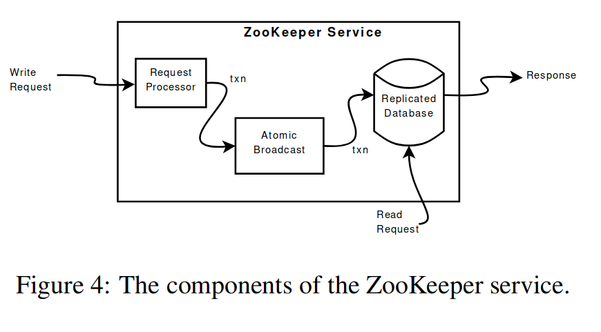

## 背景

Zookeeper 是一个简单且高性能的分布式协调系统，它自身不实现任何用户所需的协调功能，但提供了一个内核（一组 API）供用户实现自己的分布式协调原语。用户通常使用 zookeeper 实现以下功能：
- 可容错的元数据存储
- 服务发现
- 分布式锁
- 组成员管理
- 领导者选举

zookeeper 使得分布式系统的协调变成了一个独立的组件，从而解耦了分布式系统内的协调和其他组件，使得设计可容错的分布式系统更加容易。

## 会话

ZooKeeper 使用会话标示客户端和 Zookeeper 的连接，如果 ZooKeeper 一段时间（超时时间）内没有接收到来自此会话的任何信息，就可以认为客户端发生故障，主动断开回话。

## 数据模型

zookeeper 实现了 wait-free 的通用共享对象，并将所有对象组织称一颗树，为用户提供了类似 POSIX 文件系统的抽象。

wait-free 指不论对象上其他操作执行速度如何，所有操作都可以在一定步骤内完成。zookeeper 定义的操作均不依赖于任何其他操作，因此每一种操作都可以在特定步骤内完成。非 wait-free 的典型例子时某些需要上锁的操作，会出现一个操作锁住对象后，另一个操作无法在一定步骤内完成的情况。

每个数据对象称为一个 znode，保存在内存中。ZooKeeper 将 znode 组织成一颗通过路径访问的树，并提供受限的 POSIX 文件系统接口。

ZooKeeper 的 znode 根据生命周期分为两大类：
- 常规 znode：需要 client 显式创建和删除。
- 临时 znode：创建它的 client 的会话终止后自动删除。
临时 znode 的生命周期和客户端的会话生命周期同步，从而简化了客户端实现同步原语的设计。例如，客户端可以用一个临时 znode 代表自己占有了某资源，客户端出现故障，会话终结时该 znode 被自动删除，相当于释放了占有的资源。

## 接口设计

Zookeeper 的接口提供异步版本，使客户端可以一次发出多个请求而不阻塞。ZooKeeper 会将用户的异步请求流水线化以提高吞吐量。

所有接口都使用路径访问 znode，而非句柄（如 UNIX 的`FILE *`），这使 ZooKeeper 不需要维护客户端持有的句柄，减少了 ZooKeeper 要维持的状态。

## 实现

ZooKeeper 集群中，任一时刻只有一个节点作为 leader，其他节点作为 follower。Leader 使用 Zab 协议确保客户端对服务器状态的修改复制到集群所有服务器中。

Replicated 数据库是一个内存数据库，znode 的大小通常不超过 1MB。

### 一致性模型

ZooKeeper 精妙地运用异步接口和流水线技术提高吞吐量，这也要求 ZooKeeper 提供符合直觉的一致性模型，以便用户利用异步接口。

ZooKeeper 对于写操作（会修改 ZooKeeper 状态的操作），提供 A-linearizability 保证。A-linearizability 即 async linearizability。Linearizability 的原始定义中，一个客户端任意时刻只有一个已发出的请求，而 ZooKeeper 的异步 API 导致一个客户端任意时刻可能存在多个已发出请求。论文对 A-linearizability 的定义为 *all requests that update the state of ZooKeeper are serializable and respect precedence*。serilizable 指这些写等价于某种串行写的全序，respect precedence 指遵守实时要求（realtime constraint），即写是 linearizability。

ZooKeeper 还保证每个客户端的请求按照它们发出的次序执行。这种和用户视角一致的一致性模型可以极大地降低用户的心智负担。*Time, clocks, and the ordering of events in a distributed system*设计分布式锁时，专门提到过这种“发送次序和执行（接收）次序”不同带来的麻烦。从逻辑时钟的角度看，可以将同一 pipeline 中的操作视作一个逻辑时间戳，per-client FIFO 次序就是指定的全序。

ZooKeeper 的 per-client FIFO 次序也确保了客户端可以读取到它自己的写。因为读写发生于同一客户端，客户端的读必须等待它自己的写执行完毕才能读。这种情况类似于带 store buffer 的多处理器使用的 bypass 技术，参考[ 【译】内存屏障：软件黑客的硬件视角](https://kongjun18.github.io/posts/2022/11/03/)

ZooKeeper 的读是最终一致的。客户端可以直接和任意 follower 建立会话，并从 follower 读取数据，称为 local read。follower 的状态可能落后于其他服务器的状态，因此客户端可能读到旧值，但由于 Zab 共识协议，达成共识的值最终一定会扩散到集群所有服务器，因此客户端最终能读取到最新值。

### 请求处理器
Request Processor 将用户请求转化为幂等的事务，并且为每个事务分配一个单调的事务号。

幂等的事务用于简化 ZooKeeper 的快照和故障恢复。

事务号相当于一个逻辑时钟，用户可以通过事务号判断会话断开后重新连接到的服务器状态是否落后。

### 原子广播

ZooKeeper 使用 Zab 协议将对系统状态的修改复制到集群的各个节点。

Zab 协议基于多数派达成共识，因此只能容忍一半节点故障。提供比较强的次序保证，旧 Leader 宕机并选举出新 Leader 后，先前旧 Leader 的状态修改请求会被重定向到新 Leader。此外，Zab 还保证 Leader 发出的状态修改会按发出次序广播。

### 复制数据库

Zab 协议基于多数派达成共识，因此不能保证各个节点上的数据库在任何时刻都一致。

数据库一个有意思的特性是 funny snapshot，funny snapsshot 和一般的 snapshot（如 *Raft snapshot*)的不同之处在于，funny snapshot 在快照时不阻止写入，因此 funzzy snapshot 不反映 ZooKeeper 任何时刻的状态。快照时，ZooKeeper 记录所有执行的事务，因为事务是幂等的，从快照恢复时再重新执行快照 checkpoint 后的事务即可。

## 交互

客户端可以和任意节点建立会话。集群中只有有 Leader 能够执行写操作，客户端向 follower 发出的写请求会被重定向到 Leader。

ZooKeeper 典型的工作负载是读多写少，因此通过放松读一致性提高读吞吐量。客户端从会话连接的服务器读数据，称为 local read。local read 读取的数据库可能会落后于 Leader 的提交，因此 ZooKeeper 的 read 不保证 ReadAfterWrite。

客户端的会话具有超时机制，客户端必须在超时时间前向服务器发送心跳或常规消息，否则服务器会主动断开会话，释放本会话的所有资源（临时 znode）。客户端请求和服务器的响应都包含处理的事务号，崩溃重启后客户端尝试连接 ZooKeeper 的其他节点，并根据服务器返回的事务号判断新连接的服务器是否落后于先前的服务器，客户端不断尝试知道寻找到事务号更新的服务器并建立会话。

## 要点
- 幂等的事务
- 异步接口和流水线
- 一致性
- 客户端交互

## Q&A

- [x] ZooKeeper  怎样提高性能：
	- wait-free concurrent object
	- async API
	- local read

- [x] 如何确保 client 读取到最新状态？

	1. watch 机制：watch 的通知发生于对系统任何状态的读取之前。

	2. sync 指令：sync 指令强制 zookeeper 完成 sync 指令发出时的所有 pending 的写操作，因此 sync+read

- [x] replicated database 是内存数据库，这是否会导致内存不足？

	每个 znode 通常只有 1MB，因此大多数情况下不会存在内存不足的问题。如果数据量实在太大，肯定也会存在内存压力。

- [x] 为什么论文测试中，follower 被杀死后，吞吐量没有恢复到原本的水平？

	Folloer 被杀死，重启后在 client 看来，连接并没有丢失，因此 client 没有切换 follwer。

- [x] sync+read 读取到的一定是 sync 时的状态吗？是否可能存在 A sync 后 B write，然后 A read 到 B write 的值的情况，即读取到一定是 sync 后的状态，但不保证是 sync 时之前 write 写入后的状态？

	能够读取到 sync 及其以后状态即可。

## References
- *ZooKeeper: wait-free coordination for internet-scale systems.pdf*
